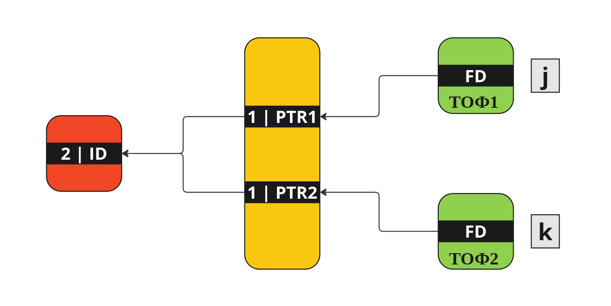
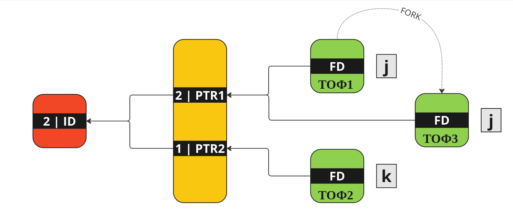

Этот большой раздел будет посвящён основным функциям языка С, необходимым для работы в _однопроцессорных_ программах. Здесь будут собраны материалы по работе со строками, с файлами и директориями, работе со временем и отображением файлов в память. Немножко теории ОСей, объясняющей происходящее; немножко теории С, а также задачки, на примерах которых мы будем разбирать работу функций. 

---

# Аргументы командной строки


Аргументы командной строки подаются при вызове программы из командной строки

```console
./a.out <аргумент1> <аргумент2> <аргумент3> ...
```

Для работы с ними внутри нашей программы используются два параметра функции `main`, которые принято называть _**argc**_ и _**argv**_\
_**argc**_ - параметр, который хранит количество поступающих в функцию аргументов\
_**argv**_ - массив строковых аргументов (все аргументы командной строки приходят в виде последовательностей символов, это сохранившаяся с момента изобретения [терминала](https://github.com/UsamG1t/Methodics_of_LinuxAppDev/blob/master/Methodical_manual/01_TerminalProject/1.%20Работа%20с%20терминалом%3B%20пример%20простого%20проекта.md) особенность).

Первый аргумент (`argv[0]`) существует всегда, это само название исполняемой программы; соответственно, `argc` всегда >= 1. Память под множество аргументов командной строки выделяется в специальном месте, в конце оканчиваясь нулевым указателем (`argv[argc] = NULL`). То есть даже не зная, какое количество аргументов приняля наша программа, мы всё равно сможем корректно каждый элемент обработать:

`argv.c`
```c
#include <stdio.h>
#include <string.h>

int main(int argc, char** argv) {
    for(int i = 1; i < argc; i++) {
        printf("%s\n", argv[i]);
    }
}
```

```console
stephen@localhost:path/to/somewhere> gcc argv.c -o argv
stephen@localhost:path/to/somewhere> ./argv
stephen@localhost:path/to/somewhere> ./argv qwerty Hello 123 100500 z1x2c3v4
qwerty
Hello
123
100500
z1x2c3v4
stephen@localhost:path/to/somewhere>
```

Но зачем нам тогда и количественный счётчик, и в памяти ограничитель? А что если за ограничитель посмотреть?

`arge.c`
```c
#include <stdio.h>
#include <string.h>

int main(int argc, char** argv) {
	int i = argc + 1;
	while (argv[i] != NULL) {
		printf("%s\n", argv[i++]);
	}
}
```

```console
stephen@localhost:path/to/somewhere> gcc arge.c -o arge
stephen@localhost:path/to/somewhere> ./arge # ждём полный крах программы
SHELL=/bin/bash # А его нет
<...>
HOSTNAME=localhost.localdomain
<...>
CPU=x86_64
<...>
PWD=/home/stephen/jaffar_torrent/Conspectology/00.C_Anthology/Attached_materials
<...>
HOME=/home/stephen
<...>
HOST=localhost.localdomain
<...>
_=./arge
stephen@localhost:path/to/somewhere> 
```

Да, как уже можно было догадаться, в памяти ровно за массивом аргументов командной строки идёт массив аргументов переменных окружения _**arge**_

Переменные окружения это уже небольшая отсылка на многопроцессорную работу нашего компьютера: мы не передавали эти данные в программу, но вызвавший её процесс (тот, который отвечает за терминал, из которого мы вызвали программу) пробросил их в наш процесс при вызове.


---

# Обработка переполнений


Выделяю этот блок отдельно, чтобы познакомить вас с прекрасным миром встроенных в С функций.

Вообще любая обработка любых ошибок должна куда-то описываться. Во время работы программы в процессе, её содержащем автоматически (если механически не сделано иное) открываются три потока для обработки данных: `stdin` - поток ввода, `stdout` - поток вывода и `stderr` - поток ошибок (тоже выходной поток, просто предназначенный именно для логирования {описания} некорректной работы программы). Для написания в `stderr` можно воспользоваться специальными функциями вывода, которые пишут направлено в него, или самому перенаправить вывод:

```c
perror("Error = ");
fprintf(stderr, "%s%s\n", "Error = ", stderror(errno));
```

 Теперь касательно переполнений. Для них есть аж **три** очень культурных и принятых кодстайлами способа проверки
  + Если разрешено пользоваться расширениями `gcc`,  можно воспользоваться специальными [встроенными функциями по обработке переполнения](https://gcc.gnu.org/onlinedocs/gcc/Integer-Overflow-Builtins.html) 
    Общий формат функции: `bool __builtin_<sign><operation><type>_overflow(type1 v1, type2, v2, type3* res)`
    Здесь `sign` отвечает за знаковость типа (`''` или`'s'` - знаковый, `'u'` - беззнаковый), `operation` за проверочную операцию (`'add'`, `'sub'`, `'mul'`), `type` за типы операндов в операции(`''` для типов <= `int`, `'l'` для `long`, `'ll'` для `long long`)
    Например, функция проверки переполнения при умножении беззнаковых `long` величин будет выглядеть `__builtin_umull_overflow`
    
    Функция получает два параметра по значению, проводит над ними операцию, результат которой записывает в третий параметр, переданный по указателю, и возвращает `true`, если переполнение было 
 
 + Если расширения нам недоступны, но мы можем пользоваться библиотекой `limits.h`, где указаны все определения характеристик общих типов переменных, можем писать проверки аналогично этой:
   ```c
	int a, b, c;
	c = a + b;
	
	if (a > 0) {
		if (b > INT_MAX - a){
			// overflow
		}
	} else if (a < 0) {
		if (b < INT_MIN - a){
			// overflow
		}
	}
	```

 + Если библиотека нам также недоступна, делаем граничные значения своими ручками:
   ```c
	max 01...1 			max = ~0u >> 1
	min 10...0 			min = ~(~0u >> 1)
	```


---

# Работа со строками


Самый популярный тип данных в С, так как через них можно описать любой объект, просто разбив его на последовательность байт и запомнив их в таком формате.

Рассмотрим набор полезных нетривиальных функций, которыми вы сможете пользоваться. Набор некоторых функций для работы со строками вот [здесь](https://www.opennet.ru/man.shtml?topic=string.h&category=3&russian=5) и не только.

 + `strtol / strtoll / strtod`  - получает строковый параметр, преобразовыввает его в число типа `long / long long / double` соответственно.
   
   Обрабатывает строку с начала до появления первого нецифрового символа
   
   Параметры: 
    1. Строка-источник; 
    2. Указатель, бегущий по строке до первого нецифрового символа; 
    3. Система счисления числа (обрабатывает от СС 2 до 36 (10 цифр + 26 символов английского алфавита, которые могут встречаться для обозначения "цифр" от `10` до `35` включительно); 0 - распознавание по умолчанию, поддерживает распознавание 10-СС, 2-СС для `0b`-чисел, 8-СС для `0`-чисел и 16-СС для `0x`-чисел)
   
   _**TODO**_: проверить, что ещё можно поймать по умолчанию, какие ещё CC
   
   Так как функции написаны для перевода строкового параметра в ограниченный набор типов, а мы далеко не всегда хотим работать именно с указанными, а ещё далеко не всегда обработка проводится корректно (например, параметр `123asdf48` вполне обработается и ошибки не выдаст, но считает только первые три цифры (если мы не указали СС, которая сможет это считать), при этом указатель застынет на символе `'a'`), нужно уметь правильно обрабатывать ошибочные ситуации работы с этой функцией. 
   Рассмотрим пример обработки ошибок при считывании значения типа `int` с помощью `strtol`:
```c
char *eptr = NULL;
errno = 0;
long lval = strtol(str, &eptr, 10);
if (errno || *eptr || eptr == str || (int) lval != lval) {
	// ошибка преобразования
}
``` 

Разберём, что здесь происходит:

 + **`errno`**: Это встроенная в библиотеку ошибок `errno.h` переменная, которая при ошибке выполнения какой-либо функции принимает значение кода её ошибки. Следовательно, если эта переменная ненулевая, что-то при получении числа пошло не так;
 + **`*eptr`**: Этот указатель считывает символы со строки, чтобы потом их преобразовать в цифры/числа и собирать итоговое число. Правильный ввод должен считать всю строку и остановиться на нулевом байте после неё. Соответственно, разыменование этого указателя должно давать нам ноль при корректной работе. Если же он остановился где-то в середине строки (следовательно, разыменовался на чём-то кроме нулевого байта), это ошибка;
 + **`eptr == str`**: Указатель может вообще никуда не дёрнуться, если нам не задали аргумент. Надо проверить, что он вообще что-то читал (т.е. сдвигался от изначальной позиции);
 + **`(int) lval != lval`**: Это выражение проверяет, что считанное число соответствует типу, который мы изначально планировали получить.;

Пример задачи с использованием `strtol`: **посчитать сумму int-чисел в командной строке, заданных в 23-СС**

`strtol.c`
```c
#include <stdio.h>
#include <stdlib.h>
#include <unistd.h>
#include <errno.h>

int main(int argc, char** argv) {
	long lval;
	int sum = 0;
	char *eptr;

	for (int i = 1; i < argc; i++) {
		eptr = NULL;
		errno = 0;

		lval = strtol(argv[i], &eptr, 23);
		if (errno || *eptr || eptr == argv[i] || (int) lval != lval) {
			_exit(1);
		}

		sum += lval;
	}

	printf("%d\n", sum);

	return 0;
}
```

```console
stephen@localhost:path/to/somewhere> gcc strtol.c -o strtol
stephen@localhost:path/to/somewhere> ./strtol 
0
stephen@localhost:path/to/somewhere> ./strtol 123 abc ll
6637
stephen@localhost:path/to/somewhere> 
```

---

 + `snprintf` - форматная запись `printf` в строковую переменную заданного размера\
   `len = snprintf(char* str, size_t size, const char* format, <...>);`

	1. `str[len] = '\0'`
	2. Возвращает количество символов без нулевого байта

 + `sscanf` - форматное чтение `scanf` из заданной строки. 

Пример: **Подаётся текст (набор строк) до 255 символов в строке. Каждая строка содержит вещественные числа, необходимо посчитать сумму по каждой строке, вывести всё одной строкой**

`str_inout.c`
```c
#include <stdio.h>
#include <stdlib.h>
#include <string.h>

enum
{
    MAX_LEN = 256
};

int
main(void)
{
    char string[MAX_LEN];
    char result[MAX_LEN];
    int i = 1;

    while(fgets(string, MAX_LEN, stdin)) {
        char* str = string;
        double a, sum = 0;
        int offset;

        while(sscanf(str, "%lf%n", &a, &offset) == 1) { // %n - считает количество байт от начального указателя после чтения числа
            sum += a;
            str += offset;
        }
        snprintf(result, MAX_LEN, "Sum of numbers in the %d-%s string is %lf\n", i, 
            (i == 1) ? "st" : ((i == 2) ? "nd" : ((i == 3) ? "rd" : "th")), sum);
        printf("%s", result);

        i++;
    }


    return 0;
}

```

```console
stephen@localhost:path/to/somewhere> gcc str_inout.c -o str_inout
stephen@localhost:path/to/somewhere> ./str_inout 
1.2 3.4 5.6
Sum of numbers in the 1-st string is 10.200000
7.8 9.0 5
Sum of numbers in the 2-nd string is 21.800000
stephen@localhost:path/to/somewhere>
```

---

 + `memmove` - переносит данные указанного размера от одного указателя на место, указанное другим
   
   Параметры:
   1. Указатель места приёма даных
   2. Указатель начала источника данных
   3. Размер данных

Не играет роли, что за данные, с начала ли считаются; суть лишь в переносе определённого количества байт данных из одного места в другое

Пример: **Удалить символ строки под номером pos**
```c
char*
delete_symbol(char* string, int pos)
{
char* p_string = string;

p_string = memmove(p_string + pos, p_string + pos + 1, strlen(string) - pos);

return string;
}
```


---

# Работа с файлами


Для работы с обычными текстовыми файлами мы используем специальный тип `FILE*`, для открытия-закрытия файла пару `fopen-fclose` и функции работы с фаловыми строками для чтения и записи данных.

Пример: **Вводится имя файла. Посчитать количество каждой буквы в файле, другие символы игнорировать**

`file.c`
```c
#include <stdio.h>
#include <stdlib.h>
#include <ctype.h>
#include <limits.h>
#include <string.h>

enum
{
    NUM = 26
};

int main(void) {
    char name[PATH_MAX];
    fgets(name, PATH_MAX, stdin); // Да, stdin это тоже как будто FILE*

    if (strlen(name) > 0 && name[strlen(name) - 1] == '\n') {
        name[strlen(name) - 1] = '\0';
    }
    
    FILE* f1 = fopen(name, "r"); // Открыли файл на чтение

    if (f1 == NULL) {
        return 1;
    }

    unsigned long count[NUM] = {};
    int a;

    int i = 0;
    while ((a = fgetc(f1)) != EOF) { // достаём по символу из файла
        if(isalpha(a)) {
            count[tolower(a) - 'a']++;
        }
    }

    for (int i = 0; i < NUM; i++) {
        printf("\'%c\' - %lu\n", 'a' + i, count[i]);
    }

    return 0;
}

```

```console
stephen@localhost:path/to/somewhere> gcc file.c -o file
stephen@localhost:path/to/somewhere> ls
arge    argv    file    str_inout    strtol
arge.c  argv.c  file.c  str_inout.c  strtol.c
stephen@localhost:path/to/somewhere> ls > file.txt
stephen@localhost:path/to/somewhere> ./file 
file.txt
'a' - 4
'b' - 0
'c' - 5
'd' - 0
'e' - 5
'f' - 3
'g' - 4
'h' - 0
'i' - 5
'j' - 0
'k' - 0
'l' - 5
'm' - 0
'n' - 2
'o' - 4
'p' - 0
'q' - 0
'r' - 8
's' - 4
't' - 10
'u' - 2
'v' - 2
'w' - 0
'x' - 1
'y' - 0
'z' - 0
stephen@localhost:path/to/somewhere>
```

Однако наша работа будет проводиться преимущественно (почти наверное всегда) с бинарными файлами. Нас больше не будут интересовать символы, которые описываются байтами данных, нас будут интересовать сами байты. \
Работу с файлами мы будем организовывать через системные вызовы (СВ). _**СВ**_ это некий интерфейс между пользовательскими программами и ОС, осуществляющий низкоуровневую (системную) обработку запроса.

Основные библиотеки для работы с файлами
```c
#include <fcntl.h>
#include <unistd.h>
#include <sys/types.h>
#include <sys/file.h>
``` 

#### Немножко теории файловых систем: 

Между файловой системой и нами - пользователем - лежат 3 таблицы, контролирующие обращения в ФС (Первые две хранятся в ядре ОС, третья - в контексте процесса)

Первая - _Таблица Индексных Дескрипторов Открытых Файлов_ (ТИДОФ)\
В ней хранятся номера индексных дескрипторов файлов, к которым был применём системный вызов `open`. Также в служебном поле строчки с ИД записано количество ссылок на этот файл (при первом обращении запись в ТИДОФ с этим ИД создаётся, дальше - просто изменяется значение количества ссылок)

Вторая - _Таблица Открытых Файлов_ (ТОФ)\
От ТИДОФ она получает номер записи, где в ТИДОФ хранится индексный дескриптор, ассоциирует этот номер с созданным указателем ввода-вывода и сохраняет запись об этом указателе и какой-то ещё служебной инфо типа прав и флагов, с которыми был открыт файл.

Третья - _Таблица Открытых Файлов Процесса_ (ТОФП)\
От ТОФ она получает номер записи, где в ТОФ записан соответствующий этому запросу указатель, связывает с ним _файловый дескриптор_ (по сути, просто циферка), созданный непосредственно в процессе, и сохраняет запись об этом ФД в своей таблице. В этой же таблице хранятся файловые дескрипторы потоков `stdin`-`stdout`- `stderr`, автоматически открывающиеся на позициях 0-1-2 соответственно при создании процесса (НЕ вызовом `fork`)

Непосредственно пользователю из команды `open` возвращается как раз номер записи из ТОФ процесса, как дескриптор открытого файла.

***Важно:*** При создании сыновьего процесса в него пронаследуется ТОФ процесса, ТОФ ОС увеличит счётчик ссылок на указатель, но нового указателя создаваться не будет. Поэтому, н-р, для таких родственных процессов чтение из файла затруднительно. Они как бы отбирают друг у друга файл "на почитать", при этом "закладка", откуда/куда надо читать/писать - всего одна.






#### Системные вызовы для работы с файлами

 + `open` - СВ открытия\создания файла. Вся работа с файлом через него
   
```
int open(const char* name, int flg[, int mode])

flg: 
	O_CREAT - создаст файл
	O_TRUNC - удалит всё, что было в файле
	O_RDONLY - на чтение
	O_WRONLY - на запись
	O_RDWR - на чтение и запись
	O_APPEND - дописывание в конец
```

Параметры открытия можно сочетать битовыми операциями

Пример:

`int fd = open("f1", O_CREAT|O_TRUNC|O_WRONLY, 0777);` - Создаст файл, если его не было, удалит всё содержимое, откроет только на запись, права доступа к файлу установит `rwxrwxrwx`

Абсолютный аналог этому набору флагов в СВ `open` - СВ `creat`:
`int fd = creat("f1", 0777);`

Справедливости ради, права доступа ставятся не указанные, а те, что получаются в результате операции `mode & ~umask` (по ум-ю `umask = 022`)

Интерпретация параметров открытия в сравнении с параметрами при работе с текстовыми файлами:
`"a+" <=> O_RWDR|O_APPEND|O_CREAT|0755`


 + `close(fd);` - Удаляет файловый дескриптор из списка потоков

 + `off_t lseek(int fd, off_t offset, int m)`  - возвращает текущую позицию "курсора" после смещения на `offset`(байт)
```
m:
	SEEK_SET 0 - от-но начала
	SEEK_CUR 1 - от-но текущей позиции
	SEEK_END 2 - от-но конца файла
```

Благодаря данному СВ можно быстро узнать размер файла:
`n = lseek(fd, 0, 2)`

 + Функции чтения-записи в бинарный файл

`size_t read(int fd, void* buf, size_t nbytes)` - Читает из объекта по `fd` в `buf` не более, чем `nbytes` байт
`size_t write(int fd, void* buf, size_t nbytes)` - Пишет из `buf` в объект по `fd` не более, чем `nbytes` байт

Оба возвращают количество считаных \ записанных байт 

`write` может писать кусками, поэтому для безопасного написания нужно писать так:

```c
char* p = buf;

while (cnt) {
	int wr = write(fd, p, cnt);
	cnt -= wr;
	p += cnt;
}
```

Пример: **В аргументах командной строки даны имя существующего файла, имя нового файла, права доступа нового файла. Нужно создать новый файл и записать в него данные старого**

`open.c`
```c
#include <stdio.h>
#include <stdlib.h>
#include <fcntl.h>
#include <unistd.h>

enum
{
	BUF_SIZE = 1024
};

int
main(int argc, char** argv)
{
	char buf[BUF_SIZE];
	char* p;
	int fd_1, fd_2;
	
	fd_1 = open(argv[1], O_RDONLY);
	fd_2 = creat(argv[2], strtol(argv[3], &p, 0));

	int count;

	while((count = read(fd_1, buf, BUF_SIZE)) > 0) {
		write(fd_2, buf, count);
	}

	close(fd_1);
	close(fd_2);

	return 0;
}
```

```console
stephen@localhost:path/to/somewhere> gcc open.c -o open

stephen@localhost:path/to/somewhere> ./open file.txt newfile.txt 0644

stephen@localhost:path/to/somewhere> ls -la | grep newfile.txt
-rw-r--r-- 1 stephen stephen     83 Oct 23 04:44 newfile.txt

stephen@localhost:path/to/somewhere> diff file.txt newfile.txt 
stephen@localhost:path/to/somewhere> 
```

#### Форматы записи данных в память

Для сохранения данных в памяти используются два формата записи - `Big-Endian`, сохраняющий объекты в прямом порядке байт (старшие байты в начале), и `Little-Endian`, сохраняющий объекты в обратном порядке (младшие байты в начале). По умолчанию вся работа с памятью (и с записью в переменные, соответственно, тоже) ведётся в `LE`, поэтому нужно уметь ручками обрабатывать `BE` ввод-вывод данных.

Для работы с любым видом записи удобно считать байты подряд, а после собирать из них интересующие нас объекты. Для этого просто будем создавать байтовые массивы, в них считывать данные (тк sizeof(char) == 1, мы будем считывать данные в том порядке байт, в котором они записаны в памяти) и дальше разбивать их в нужном нам порядке. 

```
Пример для BE:

    char m[4];
Читаем байты, получаем их в порядке:
    |ст |   |   |мл |
И после этого формируем uns int
```

Пример: **В аргументах командной строки задан бинарный файл, состоящий из чисел типа long (32-битных) в формате BE. Поcчитать и вывести сумму чисел**

`be_in.c`
```c
#include <stdio.h>
#include <fcntl.h>
#include <unistd.h>
#include <sys/types.h>
#include <sys/file.h>

enum
{
    SIZE = 4,
    BYTE_SIZE = 8
};

int
main(int argc, char** argv)
{
    int fd_1;
    char blocks[SIZE] = {};
    long sum = 0;

    if ((fd_1 = open(argv[1], O_RDONLY)) < 0) {
        return 1;
    }
        
    while(read(fd_1, blocks, SIZE) == SIZE) {
        unsigned int a = 0;
        
        for(int i = 0; i < SIZE; i++) {
            a <<= BYTE_SIZE;
            a += blocks[i];
        }
        sum += a;
    }
    
    printf("%ld\n", sum);

    close(fd_1);
    return 0;
}
```

```console
stephen@localhost:path/to/somewhere> gcc be_in.c -o be_in
stephen@localhost:path/to/somewhere> hexdump -C be_longs.bin 
00000000  00 00 00 08 00 00 00 0d  00 00 00 38              |...........8|
0000000c
stephen@localhost:path/to/somewhere> ./be_in be_longs.bin 
77
stephen@localhost:path/to/somewhere> 
```

Пример: **На вход подаётся последовательность unsigned short. Записать в формате BE эти числа в файл из аргумента командной строки**

`be_out.c`
```c
#include <stdio.h>
#include <fcntl.h>
#include <unistd.h>
#include <sys/types.h>
#include <sys/file.h>

enum
{
    SIZE = 2,
    BYTE_SIZE = 8
};

int
main(int argc, char** argv)
{
    int fd_1;
    char blocks[SIZE] = {};
    unsigned short a;

    if ((fd_1 = creat(argv[1], 0755)) < 0) {
        return 1;
    }

    while(scanf("%hu", &a) == 1) {
        for (int i = 0; i < SIZE; i++) {
            blocks[SIZE - i - 1] = a & 0xFF;
            a >>= BYTE_SIZE;
        }

        write(fd_1, blocks, SIZE);
    }

    close(fd_1);
    return 0;
}
```
	
```console
stephen@localhost:path/to/somewhere> gcc be_out.c -o be_out
stephen@localhost:path/to/somewhere> ./be_out unsh.bin 
13 15 65535 -1 0
stephen@localhost:path/to/somewhere> hexdump -C unsh.bin 
00000000  00 0d 00 0f ff ff ff ff  00 00                    |..........|
0000000a
stephen@localhost:path/to/somewhere> 

```

# Работа с метаданными файла


Вся информация о метаданных файла хранится в специальной структуре файловой системы - _Индексном Дескрипторе_. Права доступа к файлу, его размер, тип объекта ФС, владелец - вся эта инфо хранится здесь.

**_Важно:_** Имя файла **НЕ** является его метаданным. Как минимум, под разными именами могут обозначаться жёсткие связи на один и тот же индексный дескриптор (т.е. под разными именами описывается один и тот же файл)

Для получения метаданных на нужны будут библиотеки
```c
#include <sys/stat.h>
#include <sys/types.h>
```

Системные вызовы получения метаданных
```c
int stat(const char* fname, struct stat* buf);
int lstat(const char* fname, struct stat* buf);
int fstat(int fd, struct stat* buf);
```
записывают в специальную структуру `struct stat`  данные об исследуемом объекте.

`lstat`, в отличие от двух других функций, при получении метаданных не следует символической ссылке. Это означает, что если на вход ему подать имя символической ссылки на другой файл, он выдаст информацию о самом объекте-ссылке, а не о файле, на которую она указывает 

Строение структуры `struct stat`
```c
struct stat
{
	// все размеры это unsigned short
	ino_t st_ino; // Номер индексного дескриптора
	dev_t st_dev; // Номер устройства
	mode_t st_mode; // Два байта инфо    7 на тип элемента(файл, директория)
					//	 9 на права(rwxrwxrwx)
	nlink_t st_nlink; // количество жёстких связей по ИД
	uid_t st_uid; // идентификатор владельца(создателя) файла
	gid_t st_gid; // идентификатор группы владельца(создателя) файла

	// все размеры это unsigned long 
	off_t st_size; // размер файла в байтах
	time_t st_atime; // время последнего чтения
	time_t st_mtime; // время последней записи
	time_t st_ctime; // время последнего изменения метаданных(н-р, создали жёсткую связь)
}
```


```c
struct stat buf;

if (lstat("name", &buf) < 0) {
	exit(1);
}

if (S_ISREG(buf.st_mode)) // проверка, <файл> ли это
//	S_ISDIR(buf.st_mode) // <директория>
//	S_ISLNK(buf.st_mode) // <символическая ссылка>
//	S_ISCHR(buf.st_mode) // <устройство символьного типа> [н-р, клавиатура]
//	S_ISBLK(buf.st_mode) // <устройство блочного типа> [н-р, жёсткий диск]

```

Кроме вышеописанных функций проверки типа объекта опишем функцию проверки прав доступа к файлу.

Права доступа для объектов в ФС `Unix`-систем описываются для трёх классов пользователей - владельца файла, группы владельца файла и всех остальных.

Для получения id процесса (и, соответственно, понимания, какому пользователю с какими правами принадлежит данный процесс) существуют специальные функции.

ID процесса бывает двух видов - **Эффективный** и **Реальный**. Реальный (`UID`) - это идентификатор пользователя, запустившего процесс. Эффективный (`EUID`) - идентификатор, определяющий права доступа процесса к ресурсам, и принимающий в зависимости от настройки одно из двух значений:
 + Значение идентификатора пользователя, запустившего процесс (т.е. реальный и эффективный `id` совпадают);
 + В случае установленного `sticky`-бита (проверка `buf.st_mode & S_ISVTX`) для увеличения прав - значение дентификатора владельца исполняемого процессом файла (н-р, процесс исполняет программу `ls`, которая создателем имеет пользователя `root`; тогда `EUID` будет совпадать с идентификатором `root`-пользователя);

Аналогичным способом вводятся **Эффективный** и **Реальный** идентификаторы **группы** процесса

```c
uid_t getuid(void); // возвращает реальный id процесса;
gid_t getgid(void); // возвращает реальный id группы процесса

uid_t geteuid(void); // возвращает эффективный id процесса;
gid_t getegid(void); // возвращает эффективный id группы процесса
```

```c
int access(const char* name, int mode); // Проверка, что мы(со своими правами доступа) можем с ним делать

	mode:
	    F_OK - 0 - Существует ли
	    R_OK - 4 - Могу ли читать
	    W_OK - 2 - Могу ли писать
	    X_OK - 1 - Могу ли исполнять
```

При проверке прав доступа сравниваются поля идентификаторов дескриптора и идентификаторы пользователя, действует ленивая логика:
1. Если `st_uid` совпал с `getuid`, то проверяется первая тройка прав доступа - `(rwx)rwxrwx`
2. Если `st_gid` и `getgid` совпали, то вторую - `rwx(rwx)rwx`
3. Иначе - третью - `rwxrwx(rwx)`

Пример: **Написать собственную функцию обработки прав доступа**

`my_access.h`
```c
#include <unistd.h>
#include <sys/types.h>
#include <sys/stat.h>

int
my_access(const char* name, int mode)
{
	struct stat buf;

	if (lstat(name, &buf) < 0) {
		return -5;
	}

	int access_rights = buf.st_mode & 0777;

	if (getuid() == buf.st_uid) {
		access_rights >>= 6;
	} else if (getgid() == buf.st_gid) {
		access_rights >>= 3;
	} 

	if ( mode == (access_rights & 7) ) {
		return 0;
	} else {
		return -1;
	}
}
```

Пример: **Для каждого файла из аргументов командной строки выписать малый вывод инфо команды ls - тип, права доступа, количество жёстких ссылок, размер файла и его имя** 

`my_ls.c`
```c
#include <stdio.h>
#include <sys/stat.h>

enum
{
    ACC_COUNT = 9
};

int
main(int argc, char** argv)
{
    for (int i = 1; i < argc; i++) {
        struct stat buf;
        
        if (lstat(argv[i], &buf) < 0) {
            return 1;
        }

        if (S_ISREG(buf.st_mode)) {
            printf("- ");
        } else if (S_ISDIR(buf.st_mode)) {
            printf("d ");
        } else if (S_ISLNK(buf.st_mode)) {
            printf("l ");
        }

        char access[] = "rwxrwxrwx";
        for (int j = 0; j < ACC_COUNT; j++) {
            if (buf.st_mode & (1 << (ACC_COUNT - 1 - j) )) {
                printf("%c", access[j]);
            } else {
                printf("-");
            }
        }
        printf(" ");

        printf("%hu ", buf.st_nlink);
        printf("%lu ", buf.st_size);
        printf("%s\n", argv[i]);
    }

    return 0;
}
```

```console
stephen@localhost:path/to/somewhere> gcc my_ls.c -o my_ls
stephen@localhost:path/to/somewhere> ./my_ls my_ls.c 
- rw-r--r-- 1 872 my_ls.c
stephen@localhost:path/to/somewhere> ./my_ls my_ls
- rwxr-xr-x 1 20008 my_ls
stephen@localhost:path/to/somewhere> ./my_ls .
d rwxr-xr-x 1 454 .
stephen@localhost:path/to/somewhere> 
```


---

# Обход директорий


_Директории_ для ФС - это массивы структур, в которых написаны имена логически вложенных в них объектов. \
Для прочтения директории используется системная структура `struct dirent`, которая заполняется специальным генеративным системным вызовом, и хранит в поле `d_name` локальное имя текущего исследуемого объекта в директории. Другие поля структуры нас не интересуют.\
Для обращения к внутренним объектам нужно формировать их имена относительно имени директории, в которой они лежат (т.к. мы не перемещаемся по директориям, надо относительно нашего стартового положения прописывать полные пути до файлов. Например, если в директории `"name"` лежит файл с именем `"d_name"`, то для его обработки (с помощью `stat`, например) нужно использовать имя `"name/d_name"`). Для хранения этого полного имени используется строка длины `PATH_MAX` (пути, длинее, чем указано в переменной окружения `PATH_MAX` существовать не может)

Основная библиотека для работы с директориями
```c
#include <dirent.h>
```

Пара системных вызовов открытия-закрытия директории
```c
DIR* opendir(const char* name); // возвращает файловый дескриптор объекта директории, по которому можно итерироваться для прочтения данных внутри директории.  
int closedir(DIR* fd);
```

Функция-генератор для "чтения" директории `readdir` - последовательные обращения возвращают элементы-объекты из директории, пока не кончатся
```c
DIR* d = opendir(<...>);

struct dirent *dd;
while ((dd = readdir(d)) != NULL) {
	//...
}
```

Открытие директории занимает позицию списка файловых дескрипторов, поэтому при рекурсивном обходе директории нужно сначала открыть директорию, сформировать список внутренних директорий для обхода, СНАЧАЛА закрыть эту директорию, потом открывать следующие.


Пример: **Посчитать размер всех регулярных файлов с доступом на запись в заданной директории**

`dir.c`
```c
#include <stdio.h>
#include <unistd.h>
#include <sys/stat.h>
#include <dirent.h>

int
main(int argc, char** argv)
{
    if (argc < 2) {
        return 1;
    }

    DIR* d = opendir(argv[1]);
    struct dirent* dd;
    unsigned long long size = 0;

    while ((dd = readdir(d)) != NULL) {
        char str[PATH_MAX];
        snprintf(str, PATH_MAX, "%s/%s", argv[1], dd->d_name);

        struct stat buf;
        if (lstat(str, &buf) < 0) {
            continue;
        }

        if ( S_ISREG(buf.st_mode) && !access(str, W_OK) ) {
            size += buf.st_size;
        }
    }

    printf("%llu\n", size);
    closedir(d);

    return 0;
}
```

```console
stephen@localhost:path/to/somewhere> gcc dir.c -o dir
stephen@localhost:path/to/somewhere> ./dir `pwd`
595303
stephen@localhost:path/to/somewhere> 
```

Пример: **В заданной директории удалить все регулярные файлы, заканчивающиеся на "~" или ".bak"**
```c
unlink(const char* name) // удалить файл (удаляет только эту конкретную жёсткую связь)
```

`rm_reg.c`
```c
#include <stdio.h>
#include <string.h>
#include <unistd.h>
#include <sys/stat.h>
#include <dirent.h>

int
main(int argc, char** argv)
{
    if (argc < 2) {
        return 1;
    }

    DIR* d = opendir(argv[1]);

    struct dirent* dd;

    while ((dd = readdir(d)) != NULL) {
        char str[PATH_MAX];
        snprintf(str, PATH_MAX, "%s/%s", argv[1], dd->d_name);

        struct stat buf;
        if (lstat(str, &buf) < 0) {
            continue;
        }

        if (!S_ISREG(buf.st_mode)) {
            continue;
        }

        if ( (dd->d_name[strlen(dd->d_name) - 1] == '~') ) {
            unlink(str);
        } else if ( strlen(dd->d_name) >= 4 && 
                strcmp(dd->d_name + strlen(dd->d_name) - 4, ".bak") == 0) {
            unlink(str);
        }
    }

    closedir(d);
    return 0;
}
```

```console
stephen@localhost:path/to/somewhere> gcc rm_reg.c -o rm_reg
stephen@localhost:path/to/somewhere> touch hello.bak del_me~
stephen@localhost:path/to/somewhere> ls | grep -E "(\.bak)|~"
del_me~
hello.bak
stephen@localhost:path/to/somewhere> ./rm_reg `pwd`
stephen@localhost:path/to/somewhere> ls | grep -E "(\.bak)|~"
stephen@localhost:path/to/somewhere> 
```

Пример: **В заданной директории удалить все пустые поддиректории (Подсказка: директория ВСЕГДА содержит минимум два объекта "." и ".." - ссылки на текущую и родительскую директории соответственно)**
```c
rmdir(const char* name) // удалить ПУСТУЮ поддиректорию
```

`rm_dir.c`
```c
#include <stdio.h>
#include <unistd.h>
#include <sys/stat.h>
#include <dirent.h>

int
main(int argc, char** argv)
{
    if (argc < 2) {
        return 1;
    }

    DIR* d = opendir(argv[1]);
    struct dirent* dd;

    while ((dd = readdir(d)) != NULL) {

        char str[PATH_MAX];
        snprintf(str, PATH_MAX, "%s/%s", argv[1], dd->d_name);

        struct stat buf;
        if (lstat(str, &buf) < 0) {
            continue;
        }

        if (!S_ISDIR(buf.st_mode)) {
            continue;
        }

        DIR* internal_d = opendir(str);
        struct dirent* internal_dd;

        for (int i = 0; i < 2; i++) {
            internal_dd = readdir(internal_d);
        }

        if ((internal_dd = readdir(internal_d)) == NULL) {
            closedir(internal_d);
            rmdir(str);
        }
    }

    closedir(d);
    return 0;
}
```

```console
stephen@localhost:path/to/somewhere> gcc rm_dir.c -o rm_dir
stephen@localhost:path/to/somewhere> mkdir hello_dir Im_empty
stephen@localhost:path/to/somewhere> ls -la | grep -E "hello|empty"
drwxr-xr-x 1 stephen stephen      0 Oct 23 20:47 hello_dir
drwxr-xr-x 1 stephen stephen      0 Oct 23 20:47 Im_empty
stephen@localhost:path/to/somewhere> ./rm_dir `pwd`
stephen@localhost:path/to/somewhere> ls -la | grep -E "hello|empty"
stephen@localhost:path/to/somewhere>
```


---

# Работа со временем


Абсолютное время в `Unix`-системах считается, как количество секунд, прошедшее от _1 января 1970 года_. 

Для работы со временем используется специальная структура `struct tm`, память для которой выделяется ОС автоматически при системном вызове. Но мы также можем создать свой локальный экземпляр структуры для хранения данных и оперирования над ними. 

Библиотека для работы со временем:
```c
#include <time.h>
```

Описание структуры `struct tm`
```c
struct tm
{
	int tm_sec; 	// [0...60] - 61ая секунда нужна для корректировки времени
	int tm_min; 	// [0...59]
	int tm_hour;	// [0...23]
	int tm_mday; 	// [1...31] - день месяца
	int tm_mon; 	// [0...11] - номер месяца
	int tm_year; 	// [Относительно 1900 года (т.е. 0 - это 1900, 1 - это 1901 и т.д.)]
	int tm_wday; 	// [0...6] - вск -> сб, день недели
	int tm_yday; 	// [0...365]
	int tm_isdst;   // 1, если летнее; 0, если зимнее; -1, если не определено
}
```

Основные функции работы со временем:

```c
time_t time(time_t* t); // абсолютное текущее время в секундах от 01.01.1970
			// Если t != NULL, запишет результат функции в память по указателю

struct tm* localtime(const time_t* t) // возвращает указатель на память под структуру, описывающую заданное время t

struct tm* localtime_r(const time_t* t, struct tm* ) // возвращает указатель на память под структуру и сохраняет всё в вашу структуру(второй параметр)

time_t mktime(struct tm* t) // нормализует время (32 декабря -> 1 янв след года) и возвращает абсолютное время в секундах от нормазизованного

struct tm* gmtime_r(const time_t* t, struct tm* ) 
time_t timegm(struct tm* t)
// совершают те же операции, что и две функции выше, но используют UTC-время
```

Пример: **Аргументами командной строки подаются год, день месяца и день недели. Посчитать, сколько дней в этом году подчиняются такой комбинации дня месяца и дня недели**

`mday_wday.c`
```c
#include <stdio.h>
#include <stdlib.h>
#include <time.h>
#include <errno.h>

int
main(int argc, char** argv)
{
    if (argc < 4) {
        return 1;
    }

    char* eptr = NULL;
    errno = 0;
    long year = strtol(argv[1], &eptr, 10);
    if (errno || *eptr || eptr == argv[1] || (int) year != year) {
        return 1;
    }
    
    eptr = NULL;
    errno = 0;
    long day = strtol(argv[2], &eptr, 10);
    if (errno || *eptr || eptr == argv[2] || (int) day != day) {
        return 1;
    }
	
	eptr = NULL;
    errno = 0;
    long wday = strtol(argv[3], &eptr, 10);
    if (errno || *eptr || eptr == argv[4] || (int) wday != wday) {
        return 1;
    }

    int count = 0;

    for (int i = 0; i < 12; i++) {
        struct tm time;

        time.tm_sec = 0;
        time.tm_min = 0;
        time.tm_hour = 0;
        time.tm_mday = day;
        time.tm_mon = i;    
        time.tm_year = year - 1900;
        time.tm_wday = 0;
        time.tm_yday = 0;
        time.tm_isdst = -1;
        mktime(&time);

        if (time.tm_wday == wday && time.tm_mon == i) {
            count++;
        }
    }

    printf("%d\n", count);

    return 0;
}
```

```console
stephen@localhost:path/to/somewhere> subl mday_wday.c
stephen@localhost:path/to/somewhere> gcc mday_wday.c -o mday_wday
stephen@localhost:path/to/somewhere> ./mday_wday 1666 28 0
3
stephen@localhost:path/to/somewhere> ./mday_wday 1666 32 1
0
stephen@localhost:path/to/somewhere> 
```


---

# Отображение файлов в память

Раз уж мы работаем с объектами, лежащими в файлах, и эти объекты почти всегда одного типа, хотелось бы уметь быстро и удобно интерпретировать память, где они лежат, сразу как какой-то удобный для работы агрегатор. Просто потому что разницы в том, в каких байтах лежат данные, никакой, а работу это сильно упростит  

Для этого и существуют _функции отображения файлов в память_

 Основная библиотека для работы
 ```c
#include <sys/mman.h>
```

Всё содержимое файла мы, как с `malloc`, будем отображать в память и работать с ним, как с динамическим массивом

Основная пара функций захвата-освобождения памяти
```c
void* mmap(void* addr, size_t len, int prot(3), int flag(4), int fd, off_t off)

//    возвращает - указатель на начало памяти при удаче, MAP_FAILED при ошибке

// addr - желаемый адрес для выделения памяти. МЫ ПИШЕМ ВСЕГДА 0

// len - размер данных в файле(байты)

// prot - разрешения файла
	// PROT_READ
	// PROT_READ | PROT_WRITE 		
	// права при открытии файла и эти должны совпадать

// flag - флаг приватизации
	// MAP_SHARED
	// MAP_PRIVATE - никакие изменения не будут отображаться на реальном исходном файле
	
// fd - файловый дескриптор
// off - смещение

int munmap(void* addr, size_t len);
```

Важно помнить, что при создании файла его изначальный размер равен нулю, соответственно перед работой с ним, как с памятью, эту самую память надо будет выделить - заполнить нулями.

```c
open(..., O_RDWR | O_CREAT | O_TRUNC, 0777);
// его память в этот момент 0, а надо чтобы было место
```
Делаем заполнение нулями
```c
ftruncate(int fd, size_t size)
truncate(char* name, size_t size)
```
Работают, как realloc с заполнением нулями

Пример: **В аргументах коммандной строки даны два файла. Первый хранит числа типа double. Записать во второй числа в обратном порядке**

`mman.c`
```c
#include <stdio.h>
#include <unistd.h>
#include <fcntl.h>
#include <sys/stat.h>
#include <sys/mman.h>

int
main(int argc, char** argv)
{
    if (argc < 3) {
        return 1;
    }

    int fd1 = open(argv[1], O_RDONLY);
    if (fd1 < 0) {
        return 1;
    }

    int fd2 = open(argv[2], O_RDWR | O_CREAT | O_TRUNC, 0777);
    if (fd2 < 0) {
        return 1;
    }

    struct stat buf;
    if (lstat(argv[1], &buf) < 0) {
        return -1;
    }

    double* input = mmap(NULL, buf.st_size, PROT_READ, MAP_SHARED, fd1, 0);

    ftruncate(fd2, buf.st_size);
    double* output = mmap(NULL, buf.st_size, PROT_READ | PROT_WRITE, MAP_SHARED, fd2, 0);

    if (input == NULL || output == NULL) {
        return 1;
    }

    int count = buf.st_size / sizeof(*input);

    for (int i = 0; i < count; i++) {
        output[i] = input[count - i - 1];
    }

    munmap(input, buf.st_size);
    munmap(output, buf.st_size);

    return 0;
}
```

```console
stephen@localhost:path/to/somewhere> gcc mman.c -o mman
stephen@localhost:path/to/somewhere> hexdump -C double1.bin 
00000000  33 33 33 33 33 33 f3 3f  33 33 33 33 33 33 0b 40  |333333.?333333.@|
00000010  66 66 66 66 66 66 16 40  33 33 33 33 33 33 1f 40  |ffffff.@333333.@|
00000020  00 00 00 00 00 00 22 40                           |......"@|
00000028
stephen@localhost:path/to/somewhere> ./mman double1.bin double2.bin 
stephen@localhost:path/to/somewhere> hexdump -C double2.bin 
00000000  00 00 00 00 00 00 22 40  33 33 33 33 33 33 1f 40  |......"@333333.@|
00000010  66 66 66 66 66 66 16 40  33 33 33 33 33 33 0b 40  |ffffff.@333333.@|
00000020  33 33 33 33 33 33 f3 3f                           |333333.?|
00000028
stephen@localhost:path/to/somewhere> 
```
