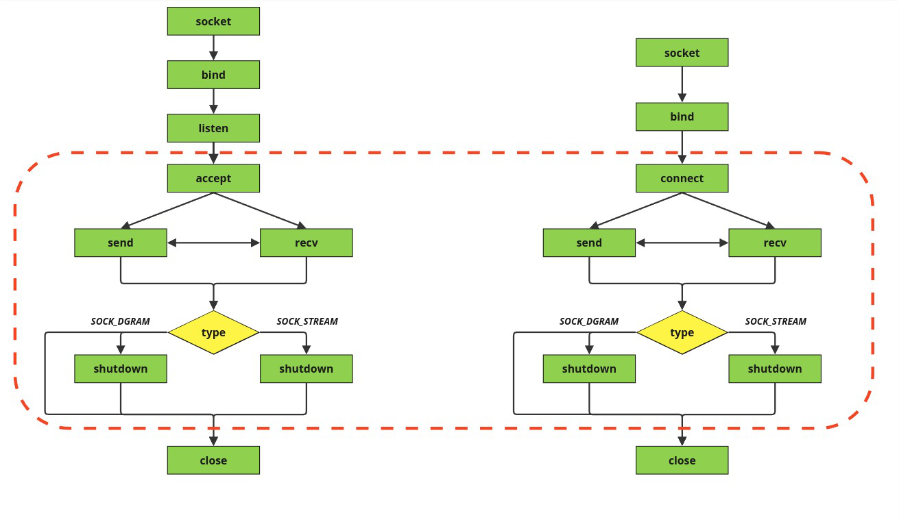
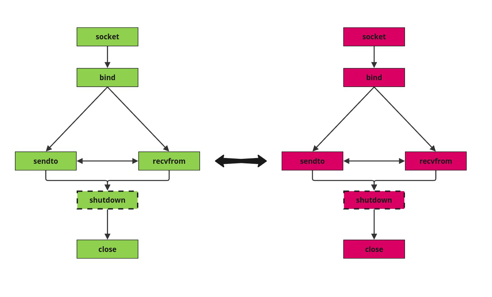

Этот большой раздел будет посвящён сетевому взаимодействию процессов. Разберёмся в теории сетевого взаимодействия, рассмотрим организацию в Си и напишем примеры межсетевого взаимодействия

# _Механизм сокетов_

#### Немножко теории

Мы уже разбрали основные средствавзаимодействияпроцессов в рамках одной системы. Эту задачу с лихвой покрывают `IPC`-объекты. Однако для организации взаимодействия процессов в сети они нам никак не помогут. Как минимум, мы не можем гарантировать уникальность именований вне рамок одной системы, да и вообще отталкиваться от ресурсов одной системы для организации взаимодействия разных других систем не представляется возможным.

В связи с этим перед разработчиками ОС стояла задача придумать новый механизм взаимодействия процессов, отвечающий целому ряду характеристик:
 + При помощи этого механизма возможно организовать и, важно, синхронизировать работу процессов, принадлежащих разным системам;
 + Механизм должен быть унифицированным для работы как с процессами разных систем, так и внутри одной системы, позволяя вообще абстрагироваться от того, где эти процессы находятся;
 + С учётом разнообразия сетевых протоколов, механизм должен был позволять работать с разными протоколами по выбору пользователя.

Решением проблемы стал **_механизм сокетов_**.

Сокеты - это обобщение понятия канала, распространяющегося как на локальное, так и на сетевое взаимодействие. С его помощью разрабатываются клиент-серверные приложения, настраиваются соединения. Общая логика механизма сокетов проста: каждый процесс настраивает сокет, после чего процессы могут парой своих сокетов установить соединение и обменяться данными.

Сокетное соединение можно разбить на два типа в зависимости от того, как происходит соединение.
1. ***Соединение с использованием виртуального канала***
   В таком виде соединения сокеты как будто схватываются друг с другом, образовывая непрерывный виртуальный канал последовательного потока байт, который сохраняется **на весь сеанс связи** (время взаимодействия процессов) и **гарантирует** надёжную доставку байт в том же порядке, что они и были переданы. Примером из жизни такого соединения служит разговор по старому проводному телефону, соединённому проводом. Единый канал связи, занимающийся на весь разговор между абонентами
   
   Из недостатков такого соединения можно выделить 2 (или даже 1.5) пункта. Во-первых, (наполовинку) данные идут к нам в виде просто потока байт и нам нужно самим делить их на сообщения. Во-вторых, создание виртуального канала "занимает" сокеты на весь сеанс, отчего, например, сервер не сможет обрабатывать никого из других клиентов, пока занят с каким-то одним из них. 
   
   
   Такой метод взаимодействия тоже имеет место быть (перекладывая на идеалогию телефонных разговоров: нам, как простому смертному не надо, чтобы пока мы разговаривали с дним человеком, нам мог дозвониться другой), но иногда полезно уметь одновременно обрабатывать сразу несколько соединений. _Вот бы взять несколько своих копий, чтобы они разговаривали, а я просто ждал кто там ещё подойдёт..._
   
   Да, решением проблемы стало создание родственных процессов, которые порождаются при получении запроса на подключение и принимают его, а после обрабатывают и завершаются по окончании сеанса. Основной же процесс-сервер просто продолжать ожидать новых клиентов, чобы и для них создать процесс-обработчик
   
   
2. ***Датаграммное соединение***
   Данный вид соединения характеризуется передачей не потока байт в защищённом канале, а обменом отдельных пакетов данных - датаграмм. Ни надёжность передачи, ни порядок их прихода от отправителя получателю не гарантированы, зато соединение работает быстрее, а также позволяет "в одиночку" процессу работать сразу с несколькими другими процессами. Аналогом из жизни здесь выступит переписка через почту. Какие-то письма могут прийти раньше тех, что были отправлены до них, а какие-т вовсе могут потеряться или быть уничтожены в процессе передачи. 
   
   
   
   При датаграммном соединении для каждого отдельного сообщения отправителю нужно указывать его получателя (адрес его сокета), а получателю нужно уметь сортировать сообщения, принятые от разных отправителей.


Так как сокеты это универсальный механизм взаимодействия процессов, которым можно пользоваться как для соединения локальных процессов, так и процессов в сети, необходимо решать задачу адресации сокетов. Одно дело в локальной сети выделить локальное пространство адресов для сокетов и совсем другое организовать доступ в сеть интернет, пройдя множество протоколов трансляции адресов, проверки соединений, доступа к таблице доменных имён итд. Поэтому при создании сокета указывается _коммуникационный домен_, задающий формат адресов, рпавила их интерпретаций, а также семейство протоколов, которые будут "обрабатывать соединение".

#### Создание и работа с сокетом

Основные библиотеки работы с сокетами
```c
#include <sys/types.h>
#include <sys/socket.h>
```

##### Создание сокета

```c
int socket (int domain, int type, int protocol);
```
```c
args:
	domain - коммуникационный домен сокета. 
		AF_UNIX - домен локального взаимодействия
		AF_INET - домен сетевого взаимодействия
	type - Тип соединения
		SOCK_STREAM - соединение с установлением виртуального канала
		SOCK_DGRAM - датаграммное соединение
	protocol - протокол взаимодействия для создания соединения в домене
		0 - Автоматический выбор // (будем делать так)
		IPPROTO_TCP - протокол TCP для AF_INET + SOCK_STREAM
		IPPROTO_UDP - протокол UDP для AF_INET + SOCK_DGRAM
```

В случае успеха функция возвращает дескриптор сокета, который системой воспринимается, как файловый дескриптор; вносится в ТОФ процесса и используется для чтения и записи в сокет.

##### Связывание сокета с адрессом

Чтобы к процессу по сокету можно было обратиться, нужно сокету присвоить адрес в домене. В зависимости от домена это может быть путь к файлу (`AF_UNIX`), или IP+порт (`AF_INET`).

```c
int bind (int sockfd, struct sockaddr *myaddr, int addrlen);
```
```c
args:
	sockfd - дескриптор сокета
	myaddr - указатель на структуру, содержащую адрес сокета. В зависимости от домена структуры выглядят по разному и расположены в разных библиотеках:
		Для AF_UNIX:
			#include <sys/in.h>
			struct sockaddr_un { 
				short sun_family; /* == AF_UNIX */
				char sun_path[108];
			};
		Для AF_INET:
			#include <netinet/in.h>
			struct sockaddr_in {
				short sin_family; /* == AF_INET */
				u_short sin_port; /* port number */
				struct in_addr sin_addr; /* host IP address */
				char sin_zero[8]; /* not used */
			};
	addrlen - реальный размер структуры myaddr
```

Важно помнить, что в случае `AF_UNIX` `bind()` создаёт файл, указанный в пути адреса, поэтому для корректной работы файл нужно перед связыванием удалять.

##### Предварительное установление соединения

Предварительное установление соединения необходимо для организации соединения сиспользованием виртуального канала. Однако для удобства соединение можно установить ив случае датаграмм - не придётся каждый раз использовать громоздкие вызовы приёма-передачи данных.

```c
int connect (int sockfd, struct sockaddr *serv_addr, int addrlen);
```
```c
args:
	sockfd - дескриптор сокета
	serv_addr - указатель на структуру, содержащую адрес сокета, с которым производится соединение
	addrlen - реальный размер структуры serv_addr
```

***Дополнение:***
В рамках клиент-серверного взаимодействия в домене `AF_INET` клиенту, вообще говоря, не так важно, какой адрес будет присвоен его сокету. Поэтому клиент может не вызывать `bind()`, тогда `connect()` просто присвоит автоматически какой-то корректный локальный адрес. В случае `AF_UNIX` связываться надо будет в обязательном порядке.

##### Прослушивание сокета и подтверждение соединения

Данные команды используются сервером, который обрабатывает сразу несколько клиентских запросов с помощью создания сыновьих процессов. Сам серверный сокет лишь получает запросы на соединение `connect()`, после чего создаётсыновий процесс, который будет подтверждать соединение и обрабатывать его.

```c
int listen (int sockfd, int backlog);
```
```c
args:
	sockfd - дескриптор сокета
	backlog - размер очереди запросов
```

Приходящие на сервер запросы буферизуются в ожидании обработки. Если присланный запрос не помещается в буфер, поведение зависит от протокола соединения:
 + Если запрос не может быть перепослал, `connect()` клиента вернёт `ECONNREFUSED`
 + Если запрос поддерживает перепосылку (типа `TCP`), то сервер просто сбрасывет пакет с запросом, как будто его и не получал. А клиент будет до победного перепосылать запрос на обработку, пока тот либо не будет обработан, либо пока не произойдёт Тайм-аут запроса протокола; тогда клиентувернётся `ETIMEDOUT`.

```c
int accept (int sockfd, struct sockaddr *addr, int *addrlen);
```
```c
args:
	sockfd - дескриптор сокета
	addr - указатель на структуру, которая будет хранить адрес клиента
	addrlen - размер структуры addr
```


##### Приём и передача данных

В случае установления виртуального канала команды передачи-приёма сообщений через сокеты просто описываютс данные, с которыми мы работаем (тк адресат и адресант однозначно определены)

```c
int send(int sockfd, const void *msg, int len, unsigned int flags);
int recv(int sockfd, void *buf, int len, unsigned int flags);
```
```c
args:
	sockfd - дескриптор сокета
	msg - указатель на объект сообщения для отправки
	buf - указатель для объект сообщения при получении
	len - размер объекта сообщения
		Если сообщение слишком длинное для того протокола, 
		который используется при соединении, оно не передается и вызов
		возвращает ошибку EMSGSIZE.
		Если же сокет окажется переполнен, т.е. в его буфере 
		не хватит места, чтобы поместить туда сообщение, процесс
		блокируется до появления возможности поместить сообщение.
	flags - специальные опции
		MSG_OOB - осуществление приёма-передачи экстренных сообщений
		MSG_PEEK - флаг для resv, чтобы считать данные без удаления из сокета
```

Функции возвращают количество считанных\записанных байт
Так как работа с сокетами - обобщение канального взаимодействия процессов, в случае с предварительно установленным соединением мы можем пользоваться простыми `read` и `write`.

В случае датаграммного соединения предварительного установления канала (в общем случае) нет, поэтому команды кроме данных также описывают адрес сокета, на который отправляются сообщения

```c
int sendto(int sockfd, const void *msg, int len, unsigned int flags, const struct sockaddr *to, int tolen);
int recvfrom(int sockfd, void *buf, int len, unsigned int flags, struct sockaddr *from, int *fromlen);
```
```c
args:
	sockfd - дескриптор сокета
	msg - указатель на объект сообщения для отправки
	buf - указатель для объект сообщения при получении
	len - размер объекта сообщения
	flags - специальные опции
	
	to / from - указатель на структуру с адресом получателя / отправителя
	tolen / fromlen - размер структуры адреса получателя / отправителя
```


##### Завершение работы с сокетом

По окончании работы необходимо закрыть сокет. При этом, так как он водиночку отвечает и за приём, и за передачу данных, мы можем закрыть его как на один из этих видов взаимодействия, так и на оба сразу

```c
int shutdown (int sockfd, int mode);
```
```c
args:
	sockfd - дескриптор сокета
	mode - режим закрытия:
		0 - только на чтение
		1 - только на запись
		2 - полное закрытие
```

Сам дескриптор, аналогично любому другому, освобождаетсясистемным вызовом `close()`, который в случае отсутствия `shutdown()` закроет сокет. Однако есть небольшое отличие в способе закрытия с `shutdown()` и без: без него при вызове  `close()` процесс будет блокирован, если протокол сокета гарантирует доставку данных и эти данные в данный момент передаются. В случае с `shutdown()` эти данные считаются ненужными и игнорируются, закрывая сокет немедленно.

#### Общая схема взаимодействия сокетов

Кратко опишем основные действия при работе с сокетами:

##### Клиент-серверное взаимодействие


***На сервере:***
 + Создаём сокет (`socket`)
 + Связываем сокет с адресом (`bind`)
 + Прослушиваем канал (`listen`)
	 + При получении запроса (`accept`) создаём сыновий процесс для обработки
	 + Обмениваемся данными с клиентом (`send` / `recv`)
	 + Завершаем взаимодействие (`shutdown`)
	 + Закрываем сокет (`close`)
 + Завершаем взаимодействие (`shutdown`)
 + Закрываем сокет (`close`)

***На клиенте:***
 + Создаём сокет (`socket`)
 + _Связываем сокет с адресом_ (`bind`):
	 + Обязательно для локального домена (`AF_UNIX`)
	 + Опционально для сетевого домена (`AF_INET`)
 + Запрашиваем соединение с сервером (`connect`)
 + Обмениваемся данными с сервером (`send` / `recv`)
 + _Завершаем взаимодействие_ (`shutdown`):
	 + Обязательно для канального соединения (`SOCK_STREAM`) c протоколами, гарантирующими доставку (`IPPROTO_TCP`)
 + Закрываем сокет (`close`)

##### P2P канальное взаимодействие



***На каждом процессе:***
 + Создаём сокет (`socket`)
 + Связываем сокет с адресом (`bind`)
 + Запрашиваем соединение (`connect`)
 + Обмениваемся данными по каналу (`send` / `recv`)
 + _Завершаем взаимодействие_ (`shutdown`):
	 + Обязательно для канального соединения (`SOCK_STREAM`) c протоколами, гарантирующими доставку (`IPPROTO_TCP`)
 + Закрываем сокет (`close`)

##### P2P датаграммное взаимодействие



***На каждом процессе:***
 + Создаём сокет (`socket`)
 + Связываем сокет с адресом (`bind`)
 + Запрашиваем соединение (`connect`)
 + Обмениваемся данными чрез датаграммы (`sendto` / `recvfrom`)
 + _Завершаем взаимодействие_ (`shutdown`):
	 + Опционально для датаграммного соединения (`SOCK_DGRAM`) c протоколами, не гарантирующими доставку (`IPPROTO_UDP`)
 + Закрываем сокет (`close`)


