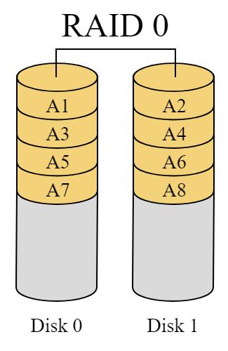
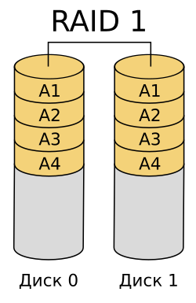
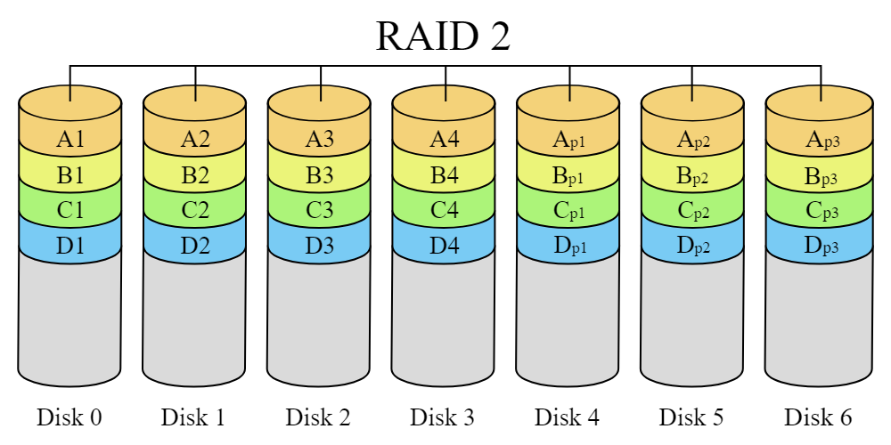
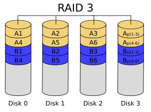
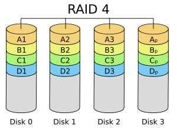
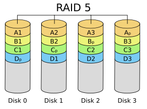
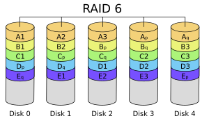

RAID - Redundant Array of Independent Disks, избыточный массив независимых (недорогих) дисков. 
RAID-система - это совокупность физических дисковых устройств, которая представляется в операционной системе, как одно устройство, имеющее возможность организации параллельных обменов. Помимо этого образуется избыточная информация, используемая для контроля и восстановления информации, хранимой на этих дисках. 
RAID-системы предполагают размещение на разных устройствах, составляющих RAID-массив, порций данных фиксированного размера, называемых полосами, которыми осуществляется обмен в таких системах. Размер полосы зависит от конкретного устройства()
На данный момент выделяют семь моделей RAID-систем (от нулевой до шестой). Рассмотрим их по порядку. 

## **RAID**-**0**
RAID 0, также известный как **striping**, представляет собой метод организации дисковых массивов, который обеспечивает высокую производительность за счет распределения данных по нескольким жестким дискам. В отличие от других уровней RAID, RAID 0 не предлагает отказоустойчивости, что означает, что потеря любого из дисков приводит к утрате всех данных в массиве.

Данные разбиваются на блоки фиксированной длины и записываются поочередно на каждый диск в массиве. Например, если в массиве два диска, первый блок данных будет записан на первый диск, второй блок — на второй диск, и так далее.

### Преимущества:
- **Высокая производительность**: RAID 0 обеспечивает максимальную скорость чтения и записи, так как операции выполняются параллельно на нескольких дисках.
- **Экономия пространства**: Весь объем дисков используется для хранения данных без резервирования.

### Недостатки:
- **Отказоустойчивость**: Если один диск выходит из строя, все данные теряются. Это делает RAID 0 менее надежным для критически важных приложений.

### Применение
RAID 0 часто используется в ситуациях, где важна высокая производительность и скорость доступа к данным, например:
- В игровых системах
- В системах обработки видео и графики
- В тестовых средах и для временных данных

### Реализация

``` C
void
RAID0_write(unsigned int N, char *buf, int Disks[2])
{
    int writeTo = Disks[N % 2];    
    int pos = (N >> 1) * 4096;  
    lseek(writeTo, pos, SEEK_SET);    
    write(writeTo, buf, 4096);    
}
```

``` C
void
RAID0_read(unsigned int N, char *buf, int Disks[2])
{    
	int readFrom = Disks[N % 2];
    int pos = (N >> 1) * 4096;    
    lseek(readFrom, pos, SEEK_SET);
    read(readFrom, pos, 4096);
}
```


## **RAID-1**
RAID 1, известный как **зеркалирование**, представляет собой метод организации дисковых массивов, обеспечивающий высокую степень надежности данных за счет дублирования информации на двух и более дисках. В случае выхода из строя одного из дисков, данные остаются доступными на другом.

В RAID 1 каждый диск содержит полную копию данных. Если в массиве два диска, то данные записываются одновременно на оба диска, создавая зеркальное отображение.
### Преимущества:
- **Высокая надежность**: При выходе из строя одного диска данные остаются доступными на другом.
- **Увеличенная скорость чтения**: Чтение данных может происходить одновременно с обоих дисков, что повышает общую производительность.

### Недостатки:
- **Высокая стоимость хранения**: Требуется вдвое больше дискового пространства для хранения одной и той же информации.
- **Невысокая скорость записи**: Запись данных может быть медленнее по сравнению с другими уровнями RAID, так как данные должны быть записаны на каждый диск.
### Применение
RAID 1 широко используется в ситуациях, где критически важна надежность хранения данных, например:
- В серверах баз данных
- В системах хранения для бизнеса
- В домашних NAS (Network Attached Storage) для резервного копирования


### Реализация

``` C
void
RAID1_write(unsigned int N, char *buf, int Disks[2])
{
    int pos = N * 4096;
    lseek(Disks[0], pos, SEEK_SET);    
    write(Disks[0], buf, 4096);
    lseek(Disks[1], pos, SEEK_SET);
    write(Disks[1], buf, 4096);
}
```

``` C
void
RAID1_read(unsigned int N, char *buf, int Disks[2]){
    char tmp[4096];    
    int pos = N * 4096;
    lseek(Disks[0], pos, SEEK_SET);    
    read(Disks[0], buf, 4096);  
    lseek(Disks[1], pos, SEEK_SET);
    read(Disks[1], tmp, 4096);      
    if (memcmp(buf, tmp, 4096)) {       
	    memcpy(buf, tmp, 4096);     
        lseek(Disks[0], pos, SEEK_SET); 
        write(Disks[0], tmp, 4096);     
    }
}
```


## **RAID 2**

RAID 2 — это уровень RAID, который использует **битовое чередование** (striping) и коды исправления ошибок Хэмминга для повышения надежности данных. Хотя он редко используется на практике, его структура интересна для понимания.

В RAID 2 данные разбиваются на отдельные биты и распределяются по нескольким дискам. Каждый бит данных хранится на отдельном диске, что позволяет достигать высокой скорости передачи данных. Для коррекции ошибок используются дополнительные диски, на которых хранятся коды Хэмминга.

Пример распределения данных:
- Данные разбиваются на биты и распределяются по дискам.
- Каждый диск содержит один или несколько битов данных.
- Дополнительные диски используются для хранения кодов Хэмминга, которые обеспечивают корректность данных.

Таким образом, RAID 2 обеспечивает высокую скорость передачи данных и надежность за счет использования кодов исправления ошибок, хотя его сложность и стоимость ограничивают его применение в современных системах.
### Преимущества:
- Высокая скорость передачи данных благодаря параллельному доступу к нескольким дискам.
- Возможность исправления одиночных ошибок и обнаружения двойных сбоев с помощью кодов Хэмминга.

### Недостатки:
- Высокая стоимость из-за необходимости большого количества дисков (как минимум 7 для эффективного использования).
- Низкая скорость обработки запросов, что делает его неподходящим для систем, ориентированных на транзакции.



~~Вы не хотите видеть реализацию этого, а я не хочу её писать, на этом и сойдемся~~

## **RAID-3**

RAID 3 — это уровень RAID, который использует **байтовое чередование** (striping) и **выделенный диск для хранения информации о четности** (parity disk). Этот уровень RAID обеспечивает высокую производительность при последовательных операциях чтения и записи, но может сталкиваться с проблемами при работе с множеством небольших запросов.

Данные разбиваются на байты и распределяются по нескольким дискам, в то время как информация о четности хранится на отдельном диске. Минимальное количество дисков для RAID 3 — три.

### Преимущества:
- Высокая скорость передачи данных при работе с большими файлами.
 - Эффективность при последовательных операциях.

### Недостатки:
- Выделенный диск для четности может стать узким местом при записи данных.
- Низкая производительность при работе с небольшими файлами из-за накладных расходов на байтовое чередование.

Таким образом, RAID 3 обеспечивает высокую скорость передачи данных и надежность за счет использования выделенного диска для четности, однако его использование ограничено из-за проблем с производительностью при множественных запросах.



### Реализация
``` C
void
write_RAID3(unsigned int N, char *buf, int Disk[NUM_OF_DISKS_RAID3])
{
    int num_of_disk = N % (NUM_OF_DISKS_RAID3 - 1); //Номер текущего диска
    int num_in_disk = Block_Size * (N / (NUM_OF_DISKS_RAID3 - 1)); // Смещение в диске

    for (int j = 0; j < NUM_OF_DISKS_RAID3; j++) { // Делаем во всех дисках одинаковые сдвиги
        lseek(Disk[j], num_in_disk, SEEK_SET);
    }
    
    for (int i = 0; i < Block_Size; i++) {
        char check_byte = 0, byte = 0;
        
        for (int j = 0; j < NUM_OF_DISKS_RAID3 - 1; j++) {
            if (j == num_in_disk) { // Если это наш диск, в него пишем 
                write(Disk[num_of_disk], &buf[i], 1);
                check_byte ^= buf[i]; // Ксорим информацию для проверочного диска
                continue;
            }
            read(Disk[j], &byte, 1); // Из не наших дисков просто ксорим данные
            check_byte ^= byte;
        }
        
        write(Disk[NUM_OF_DISKS_RAID3-1], &check_byte, 1); // Записываем сксоренный байт
    }
}
```

``` C
void
read_RAID3(unsigned int N, char *buf, int Disk[NUM_OF_DISKS_RAID3])
{
    int num_of_disk = N % (NUM_OF_DISKS_RAID3 - 1); //Номер текущего диска
    int num_in_disk = Block_Size * (N / (NUM_OF_DISKS_RAID3 - 1)); // Смещение в диске

    for (int j = 0; j < NUM_OF_DISKS_RAID3; j++) { // Делаем во всех дисках одинаковые сдвиги
        lseek(Disk[j], num_in_disk, SEEK_SET);
    }

    for (int i = 0; i < Block_Size; i++) {
        char check_byte = 0, byte = 0;

        for (int j = 0; j < NUM_OF_DISKS_RAID3; j++) {
            if (j == num_in_disk) { // Если это наш диск, из него читаем 
                read(Disk[num_of_disk], &buf[i], 1);
                continue;
            }
            read(Disk[j], &byte, 1); // Из не наших дисков (и из проверочного тоже) просто ксорим данные
            check_byte ^= byte;
        }

        if (buf[i] != check_byte) { // Если данные испорчены
            buf[i] = check_byte; //Исправляем у себя
            lseek(Disk[num_of_disk], -1, SEEK_CUR);
            write(Disk[num_of_disk], &buf[i], 1); // И в диске
        }
    }
}
```


## **RAID-4**
~~Боже дай мне сил, я не понимаю, чем отличаются друг от друга RAID-3 и RAID-4.~~

RAID 4 — это уровень RAID, который использует **блочное чередование** (striping) и **выделенный диск для хранения информации о четности**. Это позволяет обеспечить высокую производительность чтения данных, но может привести к проблемам с производительностью при записи.

Данные разбиваются на блоки и распределяются по нескольким дискам, в то время как информация о четности хранится на отдельном диске. Это позволяет выполнять параллельные операции чтения.

### Преимущества
- Высокая скорость чтения больших объемов данных.
- Высокая производительность при интенсивных запросах на чтение.
- Низкие накладные расходы для реализации избыточности.

### Недостатки:
- Запись данных может быть медленной из-за необходимости обновления диска с четностью, что приводит к блокировкам.
- Меньшая гибкость по сравнению с RAID 5, где информация о четности распределяется по всем дискам.

Таким образом, RAID 4 обеспечивает высокую скорость чтения и надежность за счет использования выделенного диска для четности, но его производительность может снижаться при записи данных.


### Реализация

``` C
void
write_RAID4(unsigned int N, char *buf, int Disk[NUM_OF_DISKS_RAID4])
{
    int num_of_disk = N % (NUM_OF_DISKS_RAID4 - 1); //Номер текущего диска
    int num_in_disk = Block_Size * (N / (NUM_OF_DISKS_RAID4 - 1)); // Смещение в диске
    char check_buffers[NUM_OF_DISKS_RAID4][Block_Size] = {};
    
    for (int j = 0; j < NUM_OF_DISKS_RAID4 - 1; j++) { // Делаем во всех информационных дисках одинаковые сдвиги и читаем из них
        lseek(Disk[j], num_in_disk, SEEK_SET);
        if (j == num_of_disk) {
            write(Disk[j], buf, Block_Size); // В наш диск предварительно пишем новые данные
            lseek(Disk[j], -Block_Size, SEEK_CUR); // Мы же при записи сдвинули указатель, возвращаем в начало строки его
        }
        read(Disk[j], check_buffers[j], Block_Size); // Читаем из информационных дисков
    }

    for (int i = 0; i < Block_Size; i++) {
        for (int j = 0; j < NUM_OF_DISKS_RAID4 - 1; j++) {
            check_buffers[NUM_OF_DISKS_RAID4 - 1][i] ^= check_buffers[j][i]; // В проверочный диск собираем ксор данных (да, побайтово, а по-другому никак, ксор не умеет в строки)
        }
    }
    lseek(Disk[NUM_OF_DISKS_RAID4 - 1], num_in_disk, SEEK_SET);
    write(Disk[NUM_OF_DISKS_RAID4 - 1], check_buffers[NUM_OF_DISKS_RAID4 - 1], Block_Size); // Записываем итог в проверочный диск
}
```

``` C
void
read_RAID4(unsigned int N, char *buf, int Disk[NUM_OF_DISKS_RAID4])
{
    int num_of_disk = N % (NUM_OF_DISKS_RAID4 - 1); //Номер текущего диска
    int num_in_disk = Block_Size * (N / (NUM_OF_DISKS_RAID4 - 1)); // Смещение в диске
    char check_buffers[NUM_OF_DISKS_RAID4][Block_Size] = {};

    for (int j = 0; j < NUM_OF_DISKS_RAID4; j++) { // Делаем во всех дисках одинаковые сдвиги и читаем из них
        lseek(Disk[j], num_in_disk, SEEK_SET);
        if (j == num_of_disk) {
            read(Disk[j], buf, Block_Size); // В наш диск читаем сразу в буфер
            continue;
        }
        read(Disk[j], check_buffers[j], Block_Size); // Для остальных дисков читаем в чек-массив
    }

    // собираем проверчную информацию
    for (int i = 0; i < Block_Size; i++) {
        for (int j = 0; j < NUM_OF_DISKS_RAID4; j++) {
            if (j == num_of_disk) {
                continue; // наш диск игнорим
            }
            check_buffers[num_of_disk][i] ^= check_buffers[j][i]; // На место нашего диска в чек-памяти собираем точно корректную версию (по ксорам всех остальных)
        }
    }

    if (memcmp(buf, check_buffers[num_of_disk], Block_Size)) { // Если данные испорчены
        memcpy(buf, check_buffers[num_of_disk], Block_Size); // Исправляем у себя
        lseek(Disk[num_of_disk], num_in_disk, SEEK_SET);
        write(Disk[num_of_disk], check_buffers[num_of_disk], Block_Size); // И в диске
    }
}
```

## **RAID-5**

RAID 5 — это уровень RAID, который использует **блочное чередование** (striping) с **распределенной четностью**. Это позволяет обеспечить как высокую производительность, так и надежность данных, позволяя восстанавливать информацию в случае сбоя одного из дисков.

Данные разбиваются на блоки и распределяются по нескольким дискам, при этом информация о четности хранится не на одном диске, а распределяется между всеми дисками массива. Это требует минимум трех дисков для работы.

### Преимущества:
- Высокая скорость чтения данных.
- Устойчивость к сбоям: при выходе из строя одного диска данные могут быть восстановлены с использованием информации о четности.
- Эффективное использование пространства: только один диск используется для хранения четности.

### Недостатки:
- Запись может быть медленнее, чем в RAID 0, из-за необходимости вычисления и записи четности.
- Производительность может снижаться при частых операциях записи.

Таким образом, RAID 5 обеспечивает высокую производительность и надежность благодаря распределенной четности, что позволяет эффективно восстанавливать данные при сбое одного из дисков.


### Реализация

``` C
int disk_num(num, shift) {
	return ((num < shift) ? num : num + 1) 
}
// Полосы левее проверочной остались в своём диске, полосы правее - уехали в следующий

void
write_RAID5(unsigned int N, char *buf, int Disk[NUM_OF_DISKS_RAID5])
{
    int num_of_disk = N % (NUM_OF_DISKS_RAID5 - 1); //Номер текущего диска
    int num_in_disk = Block_Size * (N / (NUM_OF_DISKS_RAID5 - 1)); // Смещение в диске
    int shift = (NUM_OF_DISKS_RAID5 - 1) - ((N / (NUM_OF_DISKS_RAID5 - 1)) % NUM_OF_DISKS_RAID5); // То, в какой диск переехала проверочная полоса 
    char check_buffers[NUM_OF_DISKS_RAID5][Block_Size] = {};

    for (int j = 0; j < NUM_OF_DISKS_RAID5 - 1; j++) { // Делаем во всех информационных дисках одинаковые сдвиги и читаем из них
        lseek(Disk[disk_num(j, shift)], num_in_disk, SEEK_SET);
        if (j == num_of_disk) {
            write(Disk[disk_num(j, shift)], buf, Block_Size); // В наш диск предварительно пишем новые данные
            lseek(Disk[disk_num(j, shift)], -Block_Size, SEEK_CUR); // Мы же при записи сдвинули указатель, возвращаем в начало строки его
        }
        read(Disk[disk_num(j, shift)], check_buffers[j], Block_Size); // Читаем из информационных дисков (При этом в чек-массиве (второй параметр) у нас записывается без странных сдвигов; информационные  - первые массивы, проверочный - последний)
    }

    for (int i = 0; i < Block_Size; i++) {
        for (int j = 0; j < NUM_OF_DISKS_RAID5 - 1; j++) {
            check_buffers[NUM_OF_DISKS_RAID5 - 1][i] ^= check_buffers[j][i]; // В проверочный диск собираем ксор данных (да, побайтово, а по-другому никак, ксор не умеет в строки)
        }
    }
    lseek(Disk[shift], num_in_disk, SEEK_SET);
    write(Disk[shift], check_buffers[NUM_OF_DISKS_RAID5 - 1], Block_Size); // Записываем итог в проверочный диск
}
```

``` C
int disk_num(num, shift) {
	return ((num < shift) ? num : num + 1) 
}

void
read_RAID5(unsigned int N, char *buf, int Disk[NUM_OF_DISKS_RAID5])
{
    int num_of_disk = N % (NUM_OF_DISKS_RAID4 - 1); //Номер текущего диска
    int num_in_disk = Block_Size * (N / (NUM_OF_DISKS_RAID4 - 1)); // Смещение в диске
    int shift = (NUM_OF_DISKS_RAID5 - 1) - ((N / (NUM_OF_DISKS_RAID5 - 1)) % NUM_OF_DISKS_RAID5); // То, в какой диск переехала проверочная полоса 
    char check_buffers[NUM_OF_DISKS_RAID4][Block_Size] = {};

    for (int j = 0; j < NUM_OF_DISKS_RAID5 - 1; j++) { // Делаем во всех дисках одинаковые сдвиги и читаем из них
        lseek(Disk[disk_num(j, shift)], num_in_disk, SEEK_SET);
        if (j == num_of_disk) {
            read(Disk[disk_num(j, shift)], buf, Block_Size); // В наш диск читаем сразу в буфер
            continue;
        }
        read(Disk[disk_num(j, shift)], check_buffers[j], Block_Size); // Для остальных дисков читаем в чек-массив
    }

    //проверочный диск обрабатываем отдельно, он формуле в макросе не подчиняется
    lseek(Disk[shift], num_in_disk, SEEK_SET);
    read(Disk[shift], check_buffers[NUM_OF_DISKS_RAID5 - 1], Block_Size);

    
    // собираем проверчную информацию
    for (int i = 0; i < Block_Size; i++) {
        for (int j = 0; j < NUM_OF_DISKS_RAID5; j++) {
            if (j == num_of_disk) {
                continue; // наш диск игнорим
            }
            check_buffers[num_of_disk][i] ^= check_buffers[j][i]; // На место нашего диска в чек-памяти собираем точно корректную версию (по ксорам всех остальных)
        }
    }

    if (memcmp(buf, check_buffers[num_of_disk], Block_Size)) { // Если данные испорчены
        memcpy(buf, check_buffers[num_of_disk], Block_Size); // Исправляем у себя
        lseek(Disk[disk_num(num_of_disk, shift)], num_in_disk, SEEK_SET);
        write(Disk[disk_num(num_of_disk, shift)], check_buffers[num_of_disk], Block_Size); // И в диске
    }
}
```

~~Кто может, помолитесь за то, чтобы этого у вас не было~~

## **RAID-6**
RAID 6 — это уровень RAID, который использует **блочное чередование** (striping) с **двойной четностью**. Это позволяет обеспечить высокую степень надежности, позволяя системе восстанавливать данные даже в случае одновременного выхода из строя двух дисков.

Данные разбиваются на блоки и распределяются по нескольким дискам, при этом для каждого блока данных создаются два блока четности. Это требует минимум четырех дисков.

### Преимущества:
- Высокая устойчивость к сбоям: RAID 6 может пережить выход из строя двух дисков одновременно.
- Высокая скорость чтения данных благодаря параллельному доступу к нескольким дискам.

### Недостатки:
- Запись данных может быть медленнее, чем в RAID 5, из-за необходимости вычисления двух блоков четности.
- Более сложная реализация и высокая стоимость из-за необходимости большего количества дисков.

Таким образом, RAID 6 обеспечивает высокую надежность и производительность благодаря двойной четности, что позволяет восстанавливать данные даже при выходе из строя двух дисков.


~~Если вас это хоть где-то реализовывать заставят, сама лично на этих людей порчу на понос наведу~~


Кто все-таки дочитал это до конца, скиньте мне в лс что-нибудь приятное что-ли, можете стикер любимый, я порадуюсь <3

Вы большие молодцы, у вас все обязательно получится и помните, что ни коллоквиум, ни экзамен не страшные, со всем разберемся <3

Всех люблю и целую <3
