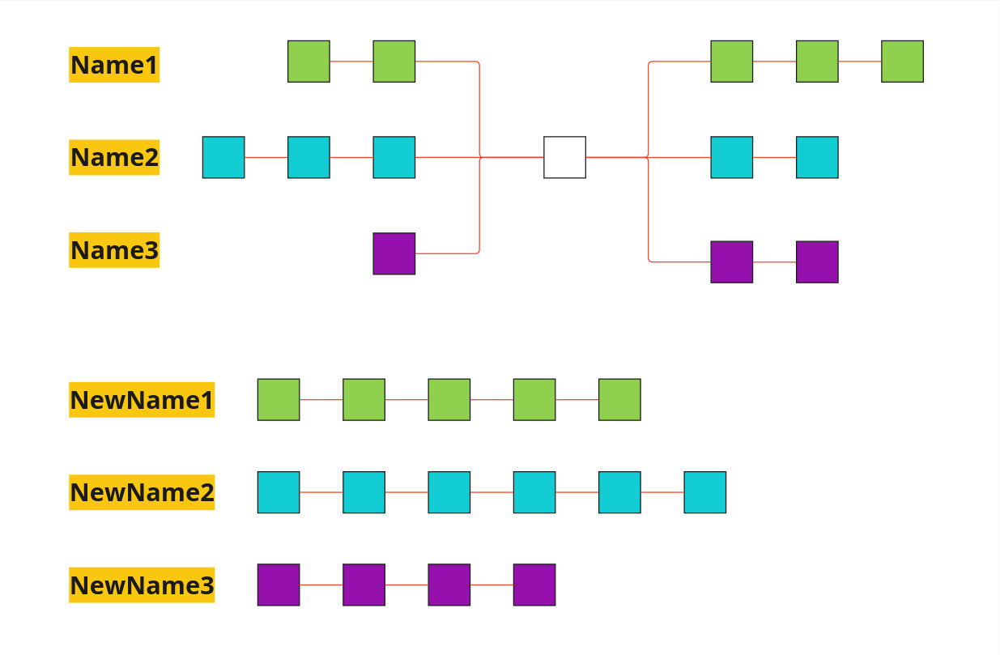

В этом большом файлике будут собраны все подсказки и гайды по темам, которые появляются в задачнике Машечкина (кроме, быть может, теор.тем, которые уже описаны в Антологиях; тогда будем просто туда ссылаться)

По оглавлению можно удобно перемещаться между задачами и смотреть конкретно интересующие вас

В некоторых темах есть дополнительные материалы (помечены отдельным заголовком) и примеры, чтобы было проще понимать структуру. Дополнительные материалы используются в ***домашках***.

---


# Задача 1

```
"В оперативном запоминающем устройстве N-разрядного компьютера используется контроль целостности данных по чётности. 
Описать возможную структуру ячейки памяти и её побитовое содержимое для случая хранения в машинном слове числа"
```

***Решение:***

 + Переводим в `2-СС` (система счисления) число `M`, дополняем при необходимости нулями до `N` разрядов;
 + Считаем количество единиц: 
	 - Если нечётное, бит чётности(== бит паритета) объявляем равным единице, иначе нулём (его значение такое, чтобы вместе с ним `<сумма единичек> % 2 == 0`)

***Ответ вида:*** `<N бит числа M>, бит чётности равен <>`

---


# Задача 2

```
"Пусть дано число M, являющееся адресом оперативной памяти, расслоённой по N банкам.
Банку с каким номером принадлежит заданный адрес?"
```

***Решение:*** 

Число `M` в `2-СС` разбивается на две части по принципу `<offset><номер банка памяти>`.
Количество бит номера == округлённый _вверх_ двоичный логарифм от количества банков: 

$$
N_{bit} = \lceil{\log_2(N)}\rceil
$$

_Основные шаги:_

 + Переводим `M` в `2-СС`
 + Считаем $N_{bit}$ по количеству банков
 + Берём последние $N_{bit}$ бит получившегося числа
 + Переводим в `10-СС`, пишем его в ответ

**Важно:**

Обязательно в ответ явно дописываем фразу `"Нумерация банков начинается с нуля"`. 
Если вдруг в самом задании сказано считать банки с _единицы_, тогда в ответ пойдёт число на один больше получившегося

***Ответ вида:*** `Банк №<`$N_{bit}$` от числа M в 10-CC>, нумерация банков начинается с нуля`

---


# Задача 3

```
"Дан 32-хразрядный IP адрес, имеющий вид M. Определить:
	К какому классу относится данный IP адрес; 
	Номер сети в k-CC
	Номер хоста в g-CC
```

***Решение:***

_Класс сети_ определяется по первым битам его двоичного представления:
 + Класс `А` - IP начинается с `0...`
 + Класс `B` - IP начинается с `10...`
 + Класс `C` - IP начинается с `110...`
 + Класс `D` - IP начинается с `1110...`
 + Класс `E` - IP начинается с `1111...`

Классы отличаются побитовым разбиением на _часть Сети_ и _часть Хоста_. Общий вид IP: 
```
<Класс><Номер Сети><Номер Хоста>
```

 + Класс `А`: 1 бит класса(0) - 7 бит сети - 24 бита (3 байта) хоста
 + Класс `B`: 2 бита класса(10) - 14 бит сети - 16 бит (2 байта) хоста
 + Класс `C`: 3 бита класса(110) - 21 бит сети - 8 бит (1 байт) хоста

Не понадобятся почти наверное, но пусть будут:
 + Класс `D`: 4 бита класса(1110) - 28 бит номер группы
 + Класс `E`: 4 бита класса(1111) - 28 бит номер группы

_Основные шаги:_

 + Перевести `M` в `2-СС`
 + Определить класс по первым битам
 + В соответствии с классом разбить IP на части Сети и Хоста
 + Выписать в ответ необходимую вам часть в соответствии с форматом вывода

**Важно:**

Самое обидное при решении задачи будет плохо `сыграть в калькулятор`. При этом важно не только правильно перевести все части, но и промежуточные состояния писать верно. В частности, при переводе `M` в `2-СС` **проверяйте количество получившихся бит**. Будет реально грустно получить минус, за то, что у вас в двоичном представлении адреса будет 33 бита. И даже если вы этот лишний бит не учтёте и правильно без него всё посчитаете, _но не уберёте_, вам могут спокойно не зачесть всю задачу.

***Ответ вида:*** `Класс сети: <>, Номер сети: <В k-CC>, Номер хоста: <В g-CC>`

### Дополнительные материалы к Задаче 3

##### Представление даных

В обычной жизни мы привыкли пользоваться классической десятичной записью `IPv4`: каждый из четырёх  _октетов_ (8-битных блоков, из которых состоит IP) представляется в виде числа в диапазоне `[0:255]` и записывается через точку.
```
168.192.10.47
```

##### Маска сети

Для некоторых реальных задач неудобно разбивать сеть по классам. Н-р, для создания сети на $2^{17}$ хостов брать класс `А`, в котором $2^{24}$ хостов - как будто неблагодарное занятие. Поэтому в `IP` появилось понятие _маски сети_. \
Маска сети - это адрес, в котором первые `n` позиций единички, оставшиеся - нолики. Маска определяет части сети и хоста в `IP`-адресе соответственно размерам своих ненулевой и нулевой частей.  Благодаря маске мы можем задавать любые размеры сети под наши нужды. \
Маску можно указывать в классическом виде `IP`-адреса (н-р, для 18 бит сети маска имеет вид `255.255.192.0`) или приставкой `/N` к адресу 

Для определения минимальной маски сети, необходимой для поддержания N хостов, нужно помнить, что, внутри сети не все адреса могут быть присвоены пользователям. \
Хост `0...0` принадлежит сети (поэтому _адрес сети_ это адрес, где на месте хоста написаны нулевые биты)\
Хост `1...1` называется `BroadCast` и используется для отправки сообщения всем абонентам сети

Поэтому если на номер хоста выделено `N` бит, мы можем записать в него $2^N-2$ пользователей.


***Пример задачи с маской*** (будет в ***домашке***, почти наверное точно не будет в ОСях):

Задан IP-адрес в классическом формате с маской: `147.96.47.15/19`. Найти класс `сети без маски`, номер хоста `сети с маской` в 8-СС, IP-адрес сети

***Решение:***

Переведём `IP`-адрес в 2-СС: $10010011\ 01100000\ 00101111\ 00001111_2$

Первые биты адреса `10` - Класс В. \
Хост определяется $32-19=13$ битами, $0 111 100 001 111_2 = 7417_8$ \
`IP`-адрес сети будет выглядеть $10010011\ 01100000\ 001 \textbf{00000\ 00000000}_2$ = `147.96.32.0`

##### Подсети

Так как на пути пакета данных при его передаче встречается множество маршрутизаторов, на каждом из них можно задать какую-то свою маску под одну и ту же сеть, благодаря чему мы получаем биты адреса, определяющие нам уникальный идентификатор подсети. При этом на каждом маршрутизаторе у нас выделяются только Сеть и Хост, просто во всей структуре итоговый адрес можно логически разбить на более мелкие части.

Например, расмотрим жилой дом, в котором два подъезда. У каждого подъезда свой маршрутизатор, а также есть маршрутизатор всего дома. Если на маршрутизаторе дома стоит маска `/19`, то для описания адресов каждого подъезда можно использовать маску `/21`, тем самым выделяя в адресе два бита для однозначного определения подъезда $(2\ бита->2^2-2=2\ хоста\ можно\ описать:\ 01\ и\ 10\ соответственно)$ 

---


# Задача 4

```
"<Задана какая-то иерархия процессов, а также код с fork() и printf()>
Считаем, что printf работает атомарно и без буферизации и обращения ко всем системным вызовам успешно отрабатывают.
Перечислить все возможные комбинации значений, которые могут быть выведены на стандартное устройство вывода 
в результате выполнения данной программы"
```

***Решение:***

К сожалению, из-за огромной вариативности одного универсального решения не существует. Однако вот несколько шагов, которые я предлагаю сделать, чтобы получить для себя информацию о том, что вообще может вывестись и есть ли у этого зависимости, а также немного доп.инфо:
 
 + _Распишите полный цикл жизни каждого процесса_, которые возникают в программе. Нас будут интересовать выводы (`printf`-ы и не только), выпишите для каждого процесса отдельно, что он вообще может выводить и в какой последовательности. Помните, что исполнение кода внутри одного процесса строго последовательное, поэтому выводы от одного процесса зависимы друг от друга (печатаются по очереди)

 + _Посмотрите зависимости между процессами_. Может, какие-то из них не могут выполнить какой-то кусок кода, пока что-то не произойдёт в другом процессе (например, `wait` заблокировал родительский процесс до того, пока какой-нибудь из сыновьих не закончит работу и не разблокирует отца)

 + Отсеяв совсем уж невозможные варианты предыдущими пунктами, _переберите все возможные варианты комбинаторики имеющихся процессов_ и для каждого случая выпишите их `printf` в этой очерёдности. Почти наверное всегда вы уже получили все ответы, однако среди них могут быть
	 - _Повторяющиеся_, надо будет убрать лишнее, 
	 - _Также невозможные_, но из каких-то неочевидных комбинаций. \
   Собрав такой список возможных выводов попробуйте пройтись по программе и найти ту последовательность действий, при которой такой вывод возможен. Если такой нет, значит и вывода такого быть не может

**Важно:**
 + При создании процесса через `fork()` в новом процессе создаётся собственное пространство имён, куда копируются все значения из родительского. Однако это два _независимых_ пространства. _Изменение в одном != изменение в обоих_
 + _wait()_ ждёт окончания `1. только одного` `2. своего сыновьего` процесса. После чего блокировка спадает
 + `getppid()` возвращает номер родительского `pid`, пока тот существует, и `1`(номер процесса `INIT`), когда родительский завершился

***Пример разбора задачи:***

*Пусть процесс с `PID A` породил два сыновьих процесса с `PID`-ами `B` и `C`:* 
```c
int main(int argc, char **argv) // PID = A
{
	if (fork() == 0) { // PID = B
		printf ("%d %d \n", getppid(), getpid());
		_exit(0);
	} 
	if (fork() == 0) { // PID = C
		printf ("%d \n", getpid());
		_exit(0);
		}
	return 0;
}
```
*Считаем, что `printf` работает атомарно и обращения ко всем системным вызовам успешно отрабатывают. Перечислить все возможные комбинации значений, которые могут быть выведены на стандартное устройство вывода в результате выполнения данной программы.*

Для начала разберёмся, что делает каждый процесс:
 + А просто создаёт двух сыновей, после чего **завершается без ожидания**, никаких выводов не делает;
 + В, создавшись первым `fork`-ом, печатает `getppid` (зависимый от А), и свой `PID`:
	 - `<getppid[A]> B` \
После чего завершается
+ C, создавшись вторым `fork`-ом, просто печатает свой `PID`:
	 - `С` \
После чего завершается

Теперь посмотрим, есть ли у нас зависимые _между процессами_ выводы. Да, есть: С печатает всё однозначно, а вот В напечатает `ppid` A, если он ещё не успел к этому моменту завершиться, и `1`, если успел. Поэтому вывод B разбивается на два варианта:
 - `А В`
 - `1 В`

Теперь переберём все возможные комбинации печати:
 + Если сначала печатает В, потом С; А **не успел** завершиться:
   ```
   A B
   C
   ```
 + Если сначала печатает В, потом С; А **успел** завершиться:
   ```
   1 B
   C
   ```
 + Если сначала печатает C, потом В; А **не успел** завершиться:
   ```
   C
   A B
   ```
 + Если сначала печатает C, потом B; А **успел** завершиться:
   ```
   C
   1 B
   ```

Это и есть все возможные выводы программы


***Пример разбора задачи:***

*Пусть процесс с `PID A` породил сыновий процесс с `PID B` :* 
```c
int main(int argc, char **argv) //PID = A
{
	int n = 42;
	if (fork() == 0) { //PID = B
		printf ("%d %d %d \n", n, getppid(), getpid());
		n = 8;
		_exit(0);
	}
	n = 10;
	printf ("%d %d \n", n, getpid());
	return 0;
}
```

*Считаем, что `printf` работает атомарно, без буферизации, и обращения ко всем системным вызовам успешно отрабатывают. Перечислить все возможные комбинации значений, которые могут быть выведены на стандартное устройство вывода в результате выполнения данной программы.*

_Посмотрим, что делает каждый процесс:_
 + А со значением `n = 42` создаёт сыновий процесс, после чего меняет значение `n = 10`и печатает его и свой `PID`:
	 - `10 А`
 + В создаётся с `n = 42`, печатает его, `getppid` (зависимый от А), и свой `PID`:
	 - `42 <getppid[A]> B` \
Отсюда, кстати, ясно, что строка `n = 8` фиктивная; она никак не повлияет на печать А (разные процессы -> разные виртуальные адресные пространства), а для B она уже ничего не меняет.

_Зависимости вывода:_
Т.к. А завершается без ожидания, для печати B существует два варианта:
- `42 А В`
- `42 1 В`

_Переберём варианты вывода:_
 + Если сначала печатает A, потом B; А **не успел** завершиться:
   ```
   10 А
   42 A B
   ```
 + Если сначала печатает A, потом B; А **успел** завершиться:
   ```
   10 А
   42 1 B
   ```
 + Если сначала печатает B, потом A; А **не может завершиться раньше** (он ещё ничего не печатал, программа не могла завершиться физически), поэтому вариант всего один:
   ```
   42 А B
   10 A
   ```


***Пример разбора задачи (усложнённый):***

Условие, как и выше, но изменён код:

```c
int main(int argc, char **argv) //PID = A
{
	int n = 42;
	if (fork() == 0) { //PID = B
		printf ("%d %d %d \n", n, getppid(), getpid());
		n = 8;
		// убрали здесь exit(0)
	}
	n = 10;
	printf ("%d %d \n", n, getpid());
	return 0;
}
```

На работу А это никак не повлияло, а вот B по завершении первого вывода выйдет из `if`, поменяет `n = 10` и напечатает `10 B`. Итого полный вывод В:
- `42 А В` или `42 1 B`
- `10 В`

Порядок печати в B определён, а вот вывод А относительно В может быть как _до обеих строк от В_, так и _между ними_ или _после них_. При этом только в случае, когда А печатает первый, возможно два варианта для вывода первой строки от В. В других случаях вывод будет однозначный: `42 А В`

Итого, полный ответ:

```
10 А
42 А B
10 В

10 А
42 1 B
10 В

42 А B
10 А
10 В

42 А B
10 В
10 А
```


---


# Задача 5

`Это теоретические вопросы, связанные с файловой системой System V`

***Решение:*** \
Кратко напомним теоретические сведения об этой системе. 


#### Структура ФС:
##### Суперблок:
В нём хранится вся основная информация о ФС: 
 + Количество индексных дескрипторов
 + Количество блоков памяти в ФС (напоминаем, что в этой системе принята _блочная структура_: все данные пишутся не последовательно, а записываются в отдельные блоки фиксированного размера, а их последовательность(для файлов, например) хранится отдельно в индексных дескрипторах)
+ Массив номеров свободных блоков и таблица свободных индексных дескрипторов (в виде _битового массива_ - `i`-ый бит характеризует заполненость/пустоту `i`-ого ИД)
+ Размер файловой системы (включая размер суперблока)

##### Область Индексных Дескрипторов:
 В этой части ФС хранятся сами _Индексные Дескрипторы_ - структуры, хранящие информацию о метаданных объектов в данной файловой системе. Важно понимать и помнить: в ФС не может быть больше файлов, чем существует ИД `(логично: иначе кто будет описывать файлы, если этим занимаются ИД, а их больше нет свободных?)`

ИД включает в себя следующие атрибуты:
 + _Ссылка на данный ИД каталогов ФС_ - показывает, сколько существует **жёстких** ссылок на данный файл. Если это значение равно нулю, ИД считается свободным, т.е. не хранит информацию ни об одном файле в ФС
 + Имя файла, имя\группу владельца, данные о модификации, размер
 + **(Самое важное для нас поле)** _Массив адресов блоков файла_ - это массив, хранящий ту самую последовательность блоков, в которые был записан файл (в соответствии с блочной структурой ФС данные в ФС записываются в произвольные свободные блоки. Соответственно, чтобы иметь доступ ко всем данным файла в нужном порядке, этот порядок нужно где-то хранить).
##### Область блоков памяти
Непосредственно, та самая область, где хранятся все данные.


#### Массив Номеров Свободных Блоков:

_Массив Номеров Свободных Блоков_ (МНСБ) представляет из себя массив неупорядоченных номеров блоков, не занятых ни одним файлом (проверяется это проходом по всем ИД по их таблицам номеров блоков файла. Если ни к одному не входит -> свободный)

Этот массив надо где-то хранить. Логично, что хранить мы его будем где-то в блоках памяти. \


В Суперблоке лежит номер первого блока с данным массивом. 
Строение этого массива в блоке такое: 
Блок разбит на ячейки длинной в машинное слово. Начиная с первого _(не с нулевого)_ он заполнен номерами свободных блоков. Если все номера свободных блоков не помещаются в один блок, то среди свободных выбирается произвольный, который будет заполняться этими номерами дальше. Он сам при этом свободным теперь не считается.
В нулевую ячейку записывается _служеный номер_: Либо **номер следующего блока**, который хранит номера сбоводных блоков, либо **ноль**, если этот блок - последний в цепочке. В последнем блоке после всех номеров стоит ограничивающий ноль, который означает окончание массива. При этом в промежутчных блоках также могут стоять нулевые значения, но они означают, что закончились элементы конкретно в этом блоке, но не в массиве


***Как происходит запрос на получение свободного блока:*** \
Начинается проход по МНСБ. Когда мы находим свободный блок, его номер выдаётся результатом на запрос, а на месте значения в МНСБ пишется нолик. \
Отдельно рассматривается случай, когда на запрос мы вернули последнее ненулевое значение блока. Тогда, по сути, мы храним блок, просто заполненный нулями. Смысла в этом нет, поэтому происходит перестроение МНСБ: следующий в цепочке блок, хранящий номера свободных блоков, становится заглавным и его номер уходит в Суперблок взамен старого. Старый заглавный блок при этом объявляется свободным и сам записывается в МНСБ (в зависимости от реализации - на первое свободное место или в конце массива)


В случае, если автоматического перестроения нет (система не смотрела заранее, что этот блок пустой, а просто по факту запроса нового блока обнаружила, что в нём ничего нет), блок просто выбрасывается в качестве свободного, а следующий в 
цепочке также становится новым заглавным блоком МНСБ.

#### Массив Адресов Блоков Файла ИД:

_Массив Адресов Блоков Файла_ хранит в себе последовательность блоков в том порядке, в котором они хранят содержимое файла, ассоциированного с этим Индексным Дескриптором. Хранение номеров здесь тоже происходит отчасти в блоках, однако в самом ИД есть отдельный массив из 13 (в более редких системах - 15) машинных слов, на основе которого строится N-уровневая организация хранения последовательности блоков

***Организация хранения последовательноси блоков в МАБФ:*** \


 + Первые десять ячеек массива хранят значения первых десяти блоков файла непосредственно `(level 0)`
 + Одиннадцатая ячейка хранит номер блока, в котором хранятся следующие `m` блоков файла ($m == <Размер\ блока>/<Размер\ машинного\ слова>$)` (level 1)`
 + Двенадцатая ячейка обеспечивает `level 2` - адресацию: она хранит номер блока, который хранит `m` номеров блоков, в каждом из которых хранится `m` номеров блоков файла.
 + Тринадцатая ячейка обеспечивает адресацию третьего уровня - блок с блоками с блоками с блоками файла. 

Если файл занимает меньшее количество блоков, то после последнего номера блока в следующую ячейку записывается ноль.


#### Файлы и обращение к ним:

Между файловой системой и нами - пользователем - лежат 3 таблицы, контролирующие обращения в ФС (Первые две хранятся в ядре ОС, третья - в контексте процесса)
 
 + ***Таблица Индексных Дескрипторов Открытых Файлов (ТИДОФ)***\
В ней хранятся номера индексных дескрипторов файлов, к которым был применём системный вызов open. Также в служебном поле строчки с ИД записано количество ссылок на этот файл (при первом обращении запись в ТИДОФ с этим ИД создаётся, дальше - просто изменяется значение количесвта ссылок)

 + ***Таблица Открытых Файлов***\
От ТИДОФ она получает номер записи, где в ТИДОФ хранится индексный дескриптор, ассоциирует этот номер с созданным указателем ввода-вывода и сохраняет запись об этом указателе и какой-то ещё служебной инфо.

 + ***Таблица Открытых Файлов Процесса***\
От ТОФ она получает номер записи, где в ТОФ записан соответствующий этому запросу указатель, связывает с ним файловый дескриптор, созданный непосредственно в процессе, и сохраняет запись об этом ФД в своей таблице.
Файловый дексриптор хранит всю инфо о правах и флагах, с которыми был открыт файл.

Непосредственно пользователю из команды `open` возвращается как раз номер записи из ТОФ процесса как дескриптор открытого файла.

***Важно:*** При создании сыновьего процесса в него пронаследуется ТОФ процесса, ТОФ ОС увеличит счётчи кссылок на указатель, но нового указателя создаваться не будет. Поэтому, н-р, для таких родственнх процессов чтение из файла затруднительно. Они как бы отбирают друг у друга файл на почитать, при этом закладка, откуда/куда надо читать/писать - всего одна. Пример с картинками есть в [Нулевой Антологии](https://github.com/UsamG1t/jaffar_torrent/blob/master/Conspectology/00.C_Anthology/0.%20%D0%90%D0%BD%D1%82%D0%BE%D0%BB%D0%BE%D0%B3%D0%B8%D1%8F%20%D1%8F%D0%B7%D1%8B%D0%BA%D0%B0%20C%20(%D0%BD%D0%B0%D1%87%D0%B0%D0%BB%D0%BE).md#%D0%BD%D0%B5%D0%BC%D0%BD%D0%BE%D0%B6%D0%BA%D0%BE-%D1%82%D0%B5%D0%BE%D1%80%D0%B8%D0%B8-%D1%84%D0%B0%D0%B9%D0%BB%D0%BE%D0%B2%D1%8B%D1%85-%D1%81%D0%B8%D1%81%D1%82%D0%B5%D0%BC).

---

#  Задача 6

```
Какова структура IP адреса класса `X` (описать все поля и их размеры)?
```

***Решение:***

Напомним, что всего рассматриваются 5 классов IP - A, B, C, D, E соответственно

A, B, C имеют одинаковую структуру: 
$$<Код\ класса><номер\ сети><Номер\ хоста>$$
A: `<0{1 бит}><7 бит сети><24 бита хоста>`
B: `<10{2 бита}><14 бит сети><16 бит хоста>`
C: `<110{3 бита}><21 бит сети><8 бит хоста>`

D и E имеют свою структуру:
`<4 бита кода класса {1110 и 1111 соответственно} ><28 бит группы>`

---

# Задача 7

```
<Задан код с fork() и printf() \ gets() , а также с неименованым каналом pipe() и чтением-записью в него функциями  read(), write()> 
Предполагается, что обращение к функции вывода на экран прорабатывает атомарно и без буферизации. Все системные вызовы прорабатывают успешно. Перечислить все возможные комбинации значений, которые могут быть выведены на стандартное устройство вывода в результате выполнения данной программы
```

***Решение:***

Данная задача похожа на №4, идеи решения (расписать каждый процесс отдельно - поискать зависимости - расписать все реализуемые перестановки перехватов процессов) здесь остаются теми же

Мы же укажем здесь на особенности работы с `pipe()`:
 + Канал имеет два дескриптора - на чтение и на запись. Эти дескрипторы наследуются сыновьим процессам;
 + Организация работы pipe - `FIFO`-очередь;
 + При вызове `read` для канала процесс попробует считать данные из канала. Если удалось всё считать, вопросов нет. Если в канале нет данных для считывания, случается одно из двух:
     + Если ещё существуют процессы (включая текущий), способные что-то написать в канал (у них открыт дескриптор на запись), `read`-процесс блокируется, пока не будут получены данные;
     + Если все другие процессы не имеют открытого дескриптора на запись, `read` возвращает -1, сообщая тем самым об ошибке чтения (вернее, здесь это интерпретируется, как `EOF` - `End Of File` (`EOF`, собственно, и равен -1, это просто забитая константа));
 + При вызове `write` для канала процесс попробует записать данные в канал. Если удалось всё записать, вопросов нет. Если в канале нет места для записи, случается одно из двух:
	 + Если ещё существуют процессы (включая текущий), способные что-то считать из канала (у них открыт дескриптор на чтение), `write`-процесс блокируется, пока не будет освобождено место для записи;
	 + Если все другие процессы не имеют открытого дескриптора на чтение, `write` возвращает -1, сообщая тем самым об ошибке записи;

**Важное дополнение**: вызовы `read` и `write` имеют третим своим параметром количество считываемых / записываемых байт. Однако на практике они могут записать / считать меньшее количество. Просто тогда меньшим будет их возвращаемое значение (оба они возвращают количество обработанных байт). Поэтому если, н-р, в канале не хватает байт, которые надо считать, и приходит команда `read`, то всё корректно считается, при этом просто возвращаемое значение `read` будет тем, сколько считалось, а не тем, что было указано 3им параметром.

---

# Задача 12

```
Дана файловая система, имеющая организацию в виде связанного списка. Пусть ссылка в файловом блоке занимает N байт, размер файлового блока равен M байт. Пусть некоторый файл из данной файловой системы содержит текстовую информацию (последовательность байтов, содержащих коды символов). За какое минимальное количество обменов можно процесть часть текста с Iого символа до Jого (Считаем, что нумерация символов в тексте начинается с 1)
```

***Решение:***

Организация ФС в виде связанного списка - такой способ хранения последовательности блоков файла, когда в самом блоке пишется ссылка на следующий блок (или ноль, если он последний)

Соответственно, содержательной информации в блоке `M - N` байт.

Нам нужно прочитать какой-то кусок текста. Сразу переместиться к этому тексту мы не можем, нам надо линейно "пролистать" блоки до нужного места (одно "листание блока == 1 обмен"). Затем пока мы читаем, мы также "листаем" блоки. 

Поэтому для этой задачи нам несущественнен номер `I` начала считывания. Главное - `J` - где конец оного.

Количество блоков, которое занимает текст вплоть до `J`-ого символа: `J / (M - N)`

Соответственно, количествно обменов равно 
$$\textrm{\lceil J / (M\ -\ N) \rceil}$$

---

# Задача 13(1)

```
При сверке целостности файловой системы i-й
элемент таблицы занятых блоков равен M. А i-й
элемент таблицы свободных блоков равен N. Описать
последовательность действий, восстанавливающих
системную информацию файловой системы.
```


***Решение:***

Вспомним, как в `Unix` реализован механизм контроля целостности блоков файловой системы. 

Периодически внутри системы проводится проверка свободных и занятых блоков путём формирования и сверки двух таблиц - занятых и свободных блоков соответственно. Таблицы представляют собой числовые (НЕ битовые) массивы и описывают состояния свободности / занятости блоков ФС.


При корректности ФС эти массивы должны представлять собой двоичные массивы, инвертирующие друг друга.

Однако в процессе работы возможны сбои (как в таблице, так и в ФС), вследствие чего в зависимости от комбинаций значений, описывающих состояние каждого блока, с ним необходимо проводить различные манипуляции.

 + (a) Случай **`0 - 0`** - описывает ситуацию, когда `i`-й блок ФС не занят (не принадлежит ни одному файлу при обходе системы по файловым дескрипторам), но почему-то не отмечен в ФС, как свободный. Такой случай не критичен и не требует мгновенного вмешательства. ФС считается целостной, а ошибка исправляется по запросу системы или после следующего обновления таблиц;
 + (b) Случай **`N - 0`** - описывает ситуацию, когда `i`-й блок ФС не занят (не принадлежит ни одному файлу при обходе системы по файловым дескрипторам), но отмечен свободным несколько раз. Такое состояние ФС некорректно и требует перестроения таблиц свободных и занятых блоков для перепроверки системы;
 + (c) Случай **`0 - M`** - описывает ситуацию, когда несколько файлов используют один и тот же блок ФС. Здесь возможны два варианта: файлы действительно используют один и тот же блок, тогда данные в нём невалидны, либо блок просто включён в массивы адресов блоков файла нескольких файловых дескрипторов. В любом случае системе необходимо разделить эти файлы по разным блокам:
	 + В системе отыскиваются M файлов, содержащих указанный блок;
	 + На свободных блоках ФС строятся копии данных файлов (копирование файлов (при отсутствии сбоев) гарантирует нам перенос данных на разные свободные блоки);
	 + Удаляются старые версии файлов (при этом в таблице свободных блоков указанный блок может быть посчитан несколько раз (так как несколько раз был "освобождён"));
	 + Скопированные файлы переименовываются под старые имена соответствующих файлов (чтобы соответствовать изначальному корректному состоянию ФС);
	 + Перестраиваем таблицы свободных и занятых блоков (так как у нас, возможно, несколько раз свободным помечен "общий" блок);

 + (d) Случай **`N - M`** - описывает комбинацию состояний (b) и (c). Решением такой коллизии является алгоритм (c) с оговоркой, что перестроение таблицы будет всегда, так как у нас точно есть несколько раз помеченный свободным блок, и это количество может только увеличиться путём многократного освобождения после удаления файлов

---

# Задача 15


`Пусть дан N-разрядный компьютер, в котором реализована M-уровневая таблица страниц. Размер страницы K байтов. Размер каждой таблицы I-ого уровня равен` $K_{i}$ `записи. Сколько записей содержит «внешняя таблица страниц»?`

Данная задача направлена на проверку ваших знаний по трансляции адресов памяти. Конкретно здесь рассматривается страничная реализация памяти, при которой вся физическая память и адресное пространство процессов независимо друг отдруга разделяются на блоки одинакового фиксированного размера - страницы. Виртуальный адрес какого-либо адресуемого объекта в памяти описывается конкатенацией номера виртуальной страницы и сдвигом по этой странице до указанного объекта. Физический адрес аналогично описывается номером физической страницы и **тем же самым** сдвигом по странице (поскольку страницы одного размера, их трансляция проводится один-к-одному, соответственно, все сдвиги внутри страницы сохраняются).


Для оптимизации памяти часто используют многоуровневые таблицы страниц. В таком случае **виртуальный** (и только он) адрес представляется конкатенацией множества номеров, описывающих последовательно выбираемые записи сначала вложенных таблиц страниц, а в конце - записи с номером физической страницы.


 Решение задачи заключается в правильном разделении виртуального адреса на составные части и расчёта размера каждой из них.

  `Алгоритм:`
   + Разбиваем блок виртуального адреса (размера `N`) на `M + 1` кусок (`M` уровней таблиц страниц и сдвиг по странице);
   + Для каждого известного блока описываем его размер исходя из двоичной записи данных ($K_i$ записей <=> $\log_2{K_i}$ бит в адресе);
   + По остаточному принципу заполняем размеры и, соответственно, количества адресуемых элементов / записей, которые спрашивают у нас в задании;

---
# Задача 17

```
Дана файловая система, имеющая архитектуру,
аналогичную fs5. Пусть размер ссылки на блок
файловой системы – N байта; размер блока M байта.
Какой предельный размер файла в блоках (байтах) могут
иметь файлы в такой файловой системе (указать
число)?
```

***Решение:***

Вспоминая картинку выше с устройством МАБС, просто играем в калькулятор:
 + Считаем количество ссылок в блоках: $K\ =\ \frac{M}{N}$; 
 + На нулевом уровне у нас всегда 10 номеров блоков;
 + `i`-й уровень максимально описывает $K^{i}$  номеров блоков файла;
 +  При требовании найти ответ `"в байтах"` не забываем итоговый ответ домножить на размер блока;

***Ответ:*** $(10 + K + K^2 + K^3) \{*\ M\}$ 

---
